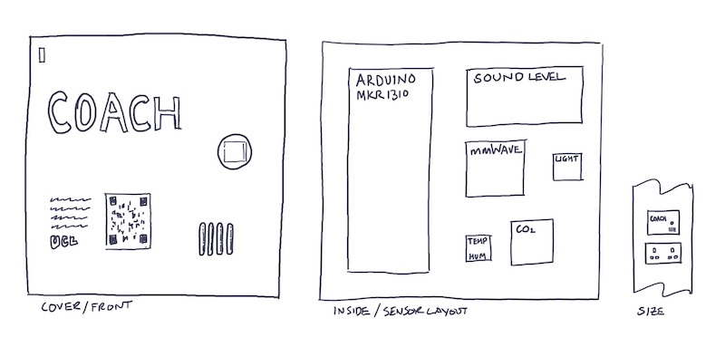

# COACH - Connected Occupancy and Clinic Health

COACH is a tool designed to provide valuable insights into workspace utilization and environmental conditions. Leveraging the power of Internet of Things (IoT) technology, COACH captures, stores, and presents real-time data to enable informed decision-making. It combines IoT technology with advanced sensors to collect data on occupancy, environmental factors, and more. The tool aims to provide a detailed understanding of workspace use and their associated environmental conditions.

# Sensor Components:

COACH incorporates various sensors to gather data on different aspects of the workspace environment. The following sensors are utilized:

a) mmWave Sensor: This sensor accurately measures presence and occupancy within a space. It helps determine the utilization of workspaces by detecting human presence.

b) Sound Level Sensor: The sound level sensor monitors decibel levels in the environment. This information assists in assessing noise levels and ensuring acoustic comfort within the workspace.

c) Light Sensor: The light sensor measures the approximate lux level, providing insights into the lighting conditions of the workspace. It helps determine the adequacy of lighting and potential areas for improvement.

d) CO2 Sensor: The CO2 sensor acts as a proxy for air quality. By measuring carbon dioxide levels, it provides an indication of indoor air quality and ventilation effectiveness.

e) Temperature and Humidity Sensors: These sensors monitor the ambient temperature and humidity levels. They help assess the overall comfort and thermal conditions within the workspace.

# Connectivity:

COACH relies on different connectivity options to facilitate data transmission and storage:

a) Sensor Unit Connectivity: The sensor units connect to the COACH system using Wi-Fi or Lora, a low-power, long-range wireless technology. This enables seamless data collection from multiple sensors deployed within the workspace.

b) Gateway Connectivity: A gateway device is employed to store data locally and transmit live data to the internet. It serves as the bridge between the sensor units and the central data processing system.

# Notes

Development notes are [over here](dev-notes.md)