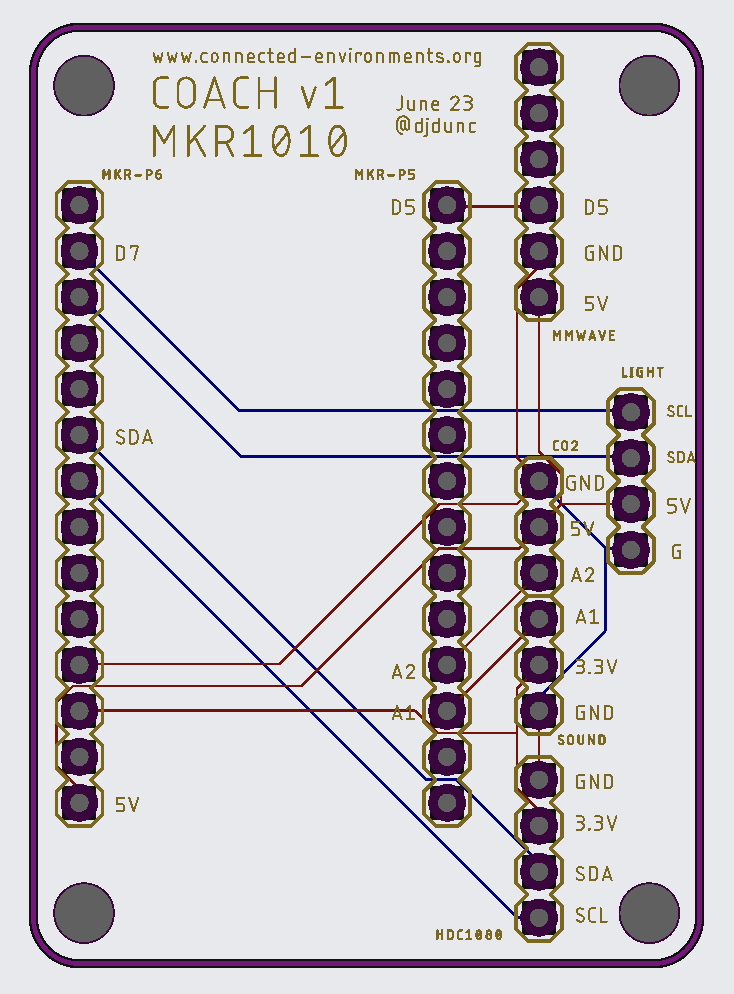
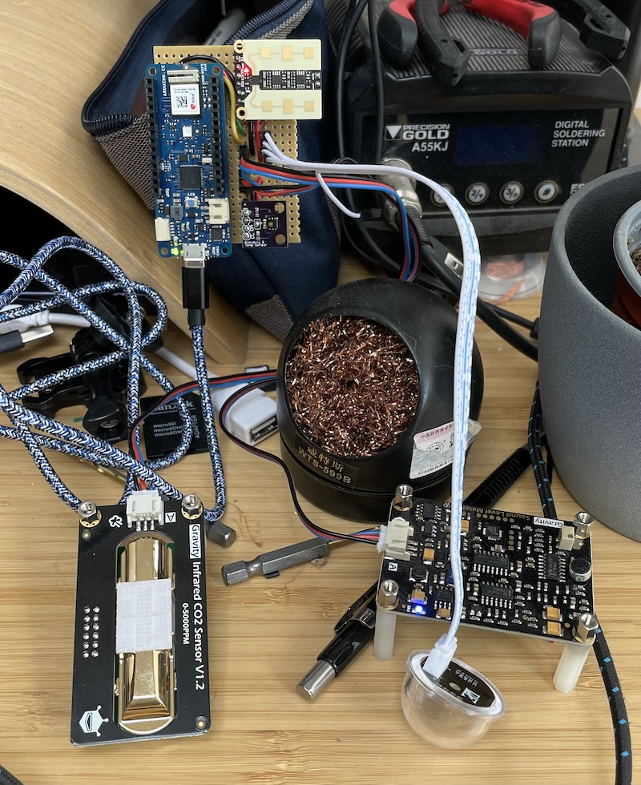
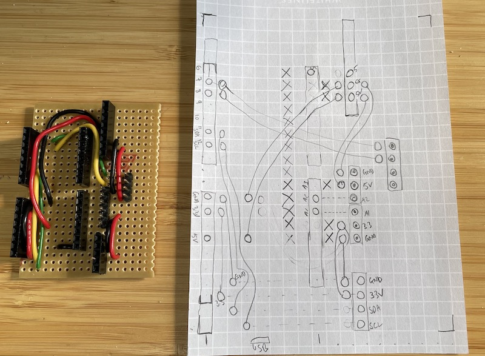
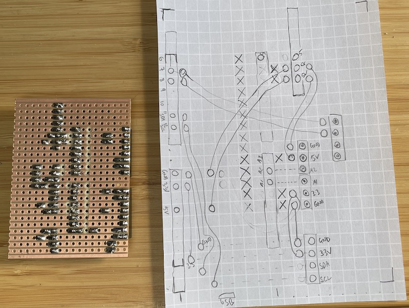
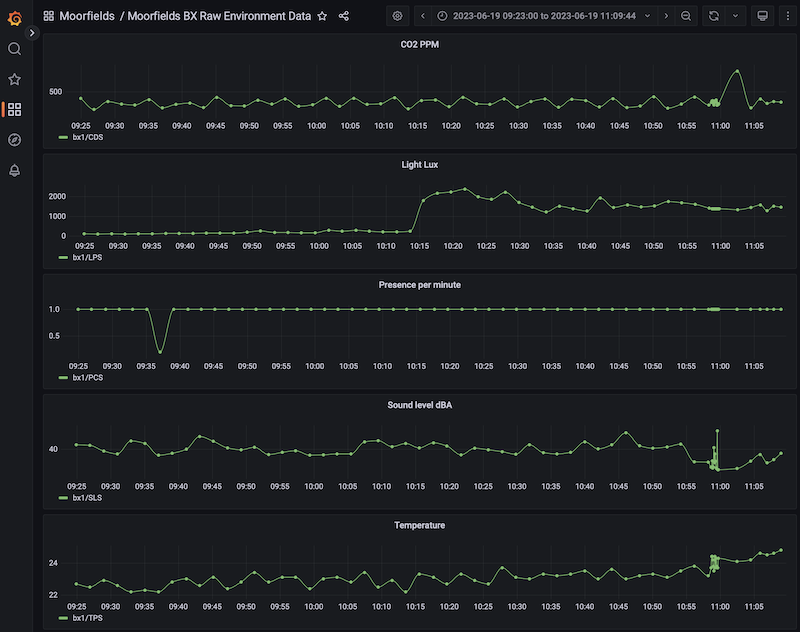
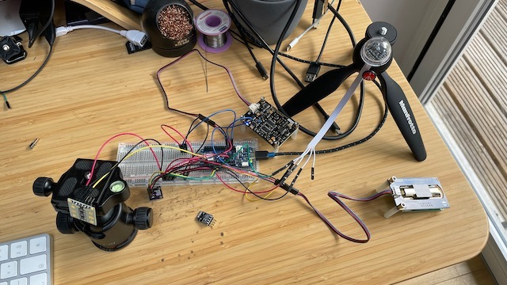

# COACH - Development notes

Notes on work in progress developing the COACH arduino scripts.

(note: listed in reverse chronology)

To do:

Calibration / programming sketch for mmWave sensor using MKR1010 - set range as 0-3

Setup RPi access point and test range

Noticed that if internet drops (but wifi still connected) the device stops sending messages when internet becomes available again. Need to check every 10 mins for internet ping and if not restart wifi.


-----
4th July

Designed v1 COACH PCB using Fusion 360 - similar to Eagle, used [this video as starting point](https://www.youtube.com/watch?v=cplzhrjvXCQ) followed by [this one](https://www.youtube.com/watch?v=eEdnImVezi8). For rounded edges used mitre function, for holes didnt use drop downs but typed in 32mm and for silverscreen moved text from "draw" layer to tNames layer - should have selected the tNames layer at outset for text on silverscreen.

Uploaded Gerber file to JCLPCB and sent for first order of boards.



-----
30th June

Spotted that device had halted - was endlessly trying to reconnect to wifi. Added in the following card to reset the MKR1010 if it doesnt come back connected after 60 seconds:

```
  // check to see if connected and wait until you are
  int counter = 0;
  while (WiFi.status() != WL_CONNECTED) {
    delay(600);
    Serial.print(".");
    blinkRGB(200, 2, 20, 150, 150);
    counter++;
    if(counter > 100){
      // Perform a system reset after 100*600 = 60seconds
      NVIC_SystemReset();   
    }
  }
```

Turns out board I had picked up for testing did not have updated wifinina firmware - so that might be cause of wifi crash.

-----
29th June
Created perf board prototype and was then having issues with reading from CO2 sensor (high readings, too high) and mmWave sensor (varying presence readings - all 1, all 0, sometimes flipping between the two)

CO2 error was powering over 3.3V - the sensor [needs 5V](https://wiki.dfrobot.com/Gravity__Infrared_CO2_Sensor_For_Arduino_SKU__SEN0219#target_4).

mmWave sensor also [required 3.6-5V](https://wiki.dfrobot.com/mmWave_Radar_Human_Presence_Detection_SKU_SEN0395) 

Redesigned board layout:







-----

26th June

Was having difficulty getting proto1 to work on office network. Kept dropping off network / not sending MQTT (although it appeared to be working). Turns out wifi connection was being dropped but loop was not catching this and still trying to send MQTT messages.

Updated to add in test to see if connection is live before trying to reconnect to MQTT broker.

-----

19th June
created coach v3 based on feedback from DFRobot re I2C clash. Have used:

```
DFRobot_B_LUX_V30B    myLux(13,7,8);
```

and moved the lux sensor to pins 7 / 8 and moved the mmWave sensor to pin 5.

-----

19th June

TIG setup - updated telegraf with following script:

```
  # -----  Moorfields Environment -----------------------------------
[[inputs.mqtt_consumer]]
   servers = ["tcp://mqtt.cetools.org:1883"]

  ## Topics that will be subscribed to.
  topics = [
    "personal/ucjtdjw/moorfields/#"
  ]
  
  client_id = "ce-mqtt-telegraf-moorfields"
  topic_tag = "moorfields-environment"
  data_format = "value"
  data_type = "string"
  ```

Created a grafana dashboard to monitor readings during testing (behind CE login):

https://grafana.cetools.org/d/QvxxMcX4z/moorfields-bx-raw-environment-data?orgId=1&from=now-1h&to=now&refresh=1m



Influx query:
```
from(bucket: "ce_bucket")
  |> range(start: v.timeRangeStart, stop: v.timeRangeStop)
  |> filter(fn: (r) => r["_measurement"] == "mqtt_consumer")
  |> filter(fn: (r) => r["moorfields-environment"] =~ /CDS/)
  |> toFloat()  
  |> aggregateWindow(every: v.windowPeriod, fn: last, createEmpty: false)
  ```

  repeated for LPS, PCS, SLS, TPS

To get formatted displayname (for when mulitple sensors will be included) used the following REGEX:

In Transform Tab:

Select "Rename by Regex"

Match: `.*moorfields\/(.*)\"}$`

Replace: `$1`

----

16th June

Setup coach v1 to test sensor with MKR1010

 * Light Sensor code based on sample at https://github.com/DFRobot/DFRobot_B_LUX_V30B 
 * DFRobot Gravity: Analog Sound Level Meter https://wiki.dfrobot.com/Gravity__Analog_Sound_Level_Meter_SKU_SEN0232
 * DFRobot Gravity: CO2 board - for 3.3v boards and v1.x sensors see: https://www.dfrobot.com/forum/topic/315493 
 * mmWave - using high low putput from GPIO2

Connected as follows:

 * GND and 5V to all sensors plus:
 * light - SCL and SDA (0x4A)
 * sound - A1
 * CO2 - A2
 * mmWave - GPIO2 on sensor to D6 on MKR1010
 * TMP36 on A0 



When connected the HDC1080 as a second I2C device was getting errors. Tried multiple HDC devices and multiple HDC libraries. All worked individually but not with the DFRobot light sensor. After a couple of hours of testing posted query to their wiki to see if others have suggestions. 

https://www.dfrobot.com/forum/topic/321033

Setup coach v2 to test wifi connectivity with all sensors.