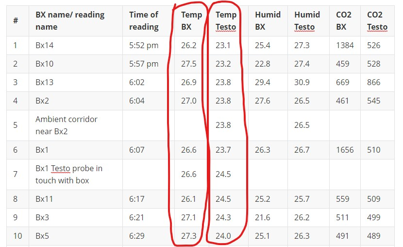
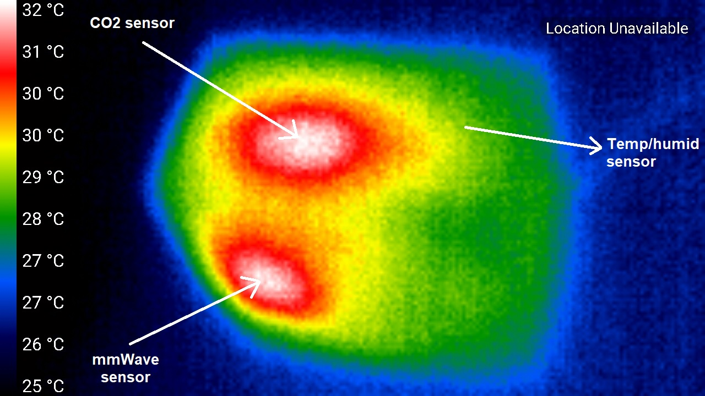
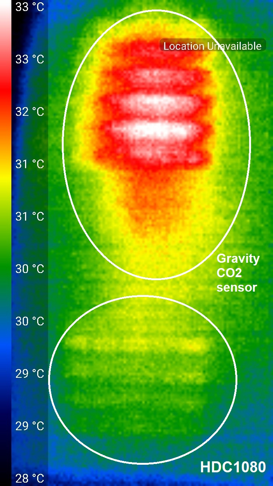
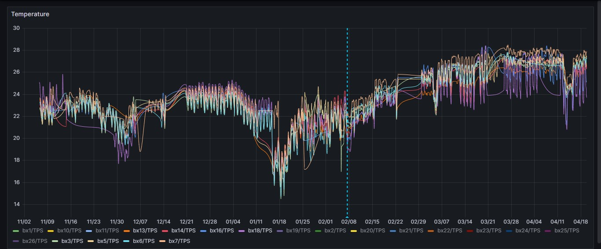
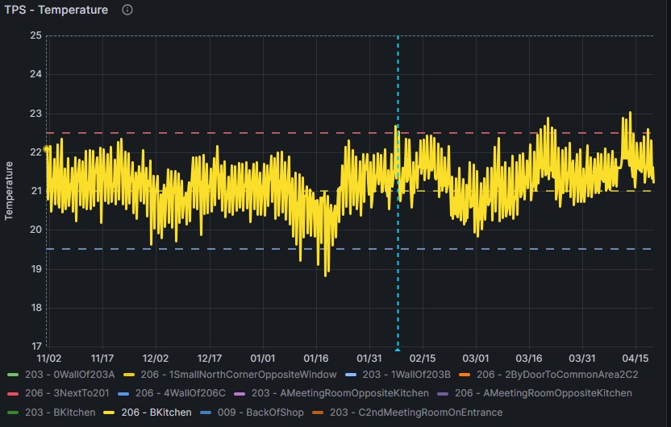

## Temperature drift discussion:

### **What is the problem?**

During the visit to Brent Cross 2 on the 18th of April, a temperature comparison between the [HDC1080](https://www.ti.com/product/HDC1080?qgpn=hdc1080) and [Testo probe](https://www.testo.com/en-UK/co2-probe-digital/p/0632-1551) showed significant difference (some times COACH boxes had 2 ~ 3 Celsius degrees more than the Testo probe).

This is clearly noticeable in the [visit log](../Visit%20log/Readme.md):

### Investigation

From a thermal study on the COACH box (using [Seek  Thermal Camera](https://www.tester.co.uk/seek-thermal-ti-camera-compact-android-usb-c-9hz?gad_source=1&gclid=Cj0KCQjwlZixBhCoARIsAIC745Bvzc7IaTo7aEwrOKzPJOU5TFZXuEwxJzezQuO7Qu9gcxABlEtdAGAaAqv2EALw_wcB)), we can see that the top heat sources are mmWave sensor and CO2 sensor. HDC1080 is going to be surely affected by this heat.

To see the extent of that effect, I used a backup COACH in OPS where I logged the temperature while the enclosure was fully assembled in vertical mode (similar to the wall-mounted setup in BX2), and then moved the HDC1080 out of the enclosure as shown in the next images. This is compared to Testo which is our ground truth.

In the case of this backup box, there was a 2 Celsius degrees difference, which falls in our original range I noticed in BX2 (2 to 3 Celsius). This process could be repeated to all boxes to verify the difference.

### What could be done?

Turned out that sensors' temperature drift is a [well-known issue](https://www.eastsensor.com/blog/pressure-sensor-temperature-drift/) in industry. All packaged devices suffer from this and some measures have to be taken during the design process and later after the data acquisition to account for that.

Although those considerations were put in mind during the design of the COACH enclosure, but the lack of a prober heat analysis did not help in fully addressing this issue. 

<u>**So lesson learned for the future**</u>: I should fully understand the heat generated from each sensor, do some simulations if possible, then minimise the heat effect during the prototyping stage of the enclosure, and finally, some heat effect will surely stay thus it has to be measured and calibrated accordingly. 
Also [Alumina ceramics](https://www.preciseceramic.com/blog/everything-about-alumina-ceramics.html#:~:text=What%20Is%20Alumina%20Ceramics%3F,%2C%20wear%2C%20and%20corrosive%20environments.) are usually used in the enclosures of temperature sensors, this could be taken into consideration.

As proposed in the [mentioned article](https://www.eastsensor.com/blog/pressure-sensor-temperature-drift/), there are 2 probable solutions for this problem:

- Either do a one-off comparison of the HDC1080 in and out of the enclosure, then calculate the offset and make the data correction (subtraction in this case).
- Or, do more measurements in different temperatures to conclude a correction curve. This is more accurate but requires a temperature-controlled chamber.

### The previous discussion addresses the temperature offset, what about the drift over time?

As noticed in the following chart, a temperature drift has been going on with the COACH boxes in BX2 which seem to be starting from mid-February. 

(Before the vertical blue line is One Pool Street, after the vertical blue line is BX2)

My hypothesis is that we are dealing with two problems:

1. A positive offset in temperature caused by the enclosure.
2. A temporal drift in temperature caused by the weather change, which is magnified by the first problem.

Let's see how is the [weather temperature in London](https://weatherspark.com/h/y/45062/2023/Historical-Weather-during-2023-in-London-United-Kingdom#Figures-Temperature) during 2024:

Let's go back to 2023 and see the history of weather temperature during the 4 seasons:

In the previous charts, we can the see the change in the outdoor temperature, but would this affect the temperature inside buildings? 
To answer this question let's see the temperature in One Pool Street during the past 5 months:

(Temperature in 206 - Kitchen)

Let's zoom out to see the previous 9 months:

(Temperature in 206 - Kitchen)

I chose the kitchen in the office area in One Pool Street because it doesn't have windows, exactly like BX2. We can see a seasonal drift in temperature readings as expected, this could explain the drift we're getting in BX2. If this hypothesis is correct, we should be getting more drift in the upcoming 2 weeks as the weather temperature is increasing.