# BX2 visit 1/8/2024

- Restarted: 24,23,6,721,10
- bx21 is a storage room now
- Broken bx11 adapter, was replaced
- Occupancy monitoring:
  - Bx19:
    - 4:33:10 on
    - 4:42:00 off
    - 4:45:10 on
    - 4:52:00 on
  - Bx10: offline
    - 4:50:00 on
    - 4:55:40 off
  - Bx20:
    - 4:55:00 on
    - 5:07:00 on
  - Bx20:
    - 5:14:00 off
    - 5:14:50 on
    - 5:15:00 off
    - 5:24:00 off
  - Bx19:
    - 5:25:00 on
    - 5:26:30 machine is off
    - 5:27:00 off

- Bx14 occupancy was correct when staff entered the cubicle 

- At 9:20 to 9:40 everyday machines are turned on

- From observation, BX19's mmWave sensor was detecting the OCT fan movement as an active occupancy, occupancy value was changed to 0 when the device was off:

  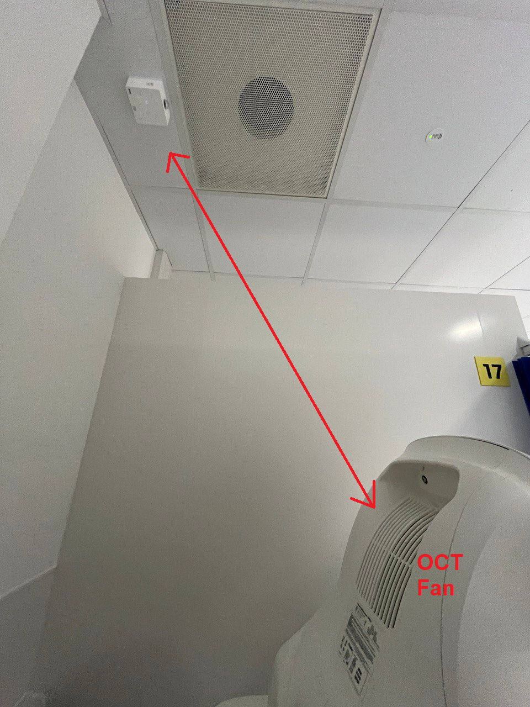

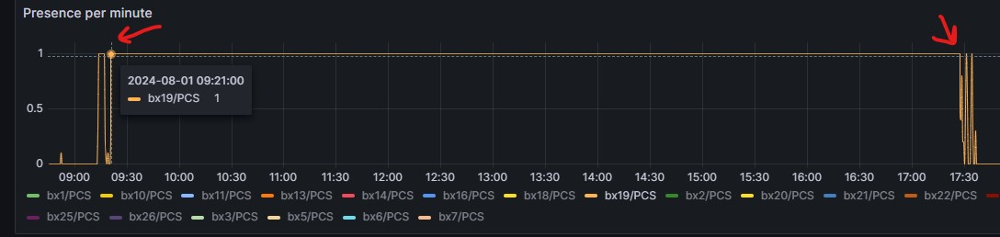

- Team debrief:
  - Some patients with wheelchairs
  - Tomorrow more staff, an easier day
  - Tomorrow Friday:  
    - MR: 24 am and 21 pm
    - GL: 24 am and 23 pm
  - Aim for 4:30 finish on Friday
  - Some staff spend more time talking with patients which delays the process. If this happens in VA this will delay the rest cubicles. 
  - It’s ok to have longer chat if the patient has a language barrier, communication problems… etc. but nothing else. 

- Sound measurements:

| BX No.            | Time    | BX dBA | RS Pro dBA | Correction value |
| ----------------- | ------- | ------ | ---------- | ---------------- |
| Bx26              | 6:42:00 | 66.9   | 47.2       | **-19.7**        |
| Bx25              | 6:36:10 | 71.7   | 46.0       | **+25.7**        |
| Bx24              | 6:38:30 | 66.3   | 47.1       | **+19.2**        |
| Bx23              | 6:43:15 | 66.1   | 49.9       | **+16.2**        |
| Bx22              | 6:48:31 | 70.9   | 50.4       | **+20.5**        |
| Bx1               | 6:53:18 | 49.6   | 48.9       | +0.7             |
| Bx3               | 6:56:35 | 50     | 47.5       | +2.5             |
| Bx5               | 7:01:22 | 49.8   | 41.9       | +7.9             |
| Bx11              | 7:05:10 | 46.7   | 44.2       | +2.5             |
| Bx26 **(again)**  | 7:23:00 | 63.9   | 44.5       | **+19.4**        |
| Bx20              | 7:21:05 | 56.2   | 31.7       | **+24.5**        |
| Bx19              | 7:22:08 | 41.7   | 31.2       | +10.5            |
| Bx13              | 7:23:48 | 44.6   | 33.8       | +10.8            |
| Bx10 **(faulty)** | 7:24:31 | 9.2    | 39.2       | **-30.0**        |
| Bx14              | 7:27:11 | 44.7   | 37.9       | +6.8             |
| Bx2               | 7:28:29 | 42.8   | 38.2       | +4.6             |
| Bx16              | 7:31:56 | 47.4   | 64.4       | **-17.0**        |
| Bx18              | 7:33:33 | 40.6   | 30.2       | +10.4            |
| Bx21              | 7:34:47 | 52.2   | 54.9       | -2.7             |
| Bx7               | 7:36:12 | 40.8   | 66.4       | **-25.6**        |
| Bx6               | 7:41:12 | 40.6   | 35.5       | +5.1             |

Notes:

- At 6:59:10 HVAC was semi-off
- At 7:23:00 HVAC was totally off (got more quite)

# Bx2 visit 25/7/2024

- Restarted 10, 11, 20, 23
- Had a meeting with Gabriela, key points:
  - 

# Bx2 visit 18/7/2024

- Restarted 26, 25, 22, 16, 5
- BX26 had a broken USB cable, it was replaced.

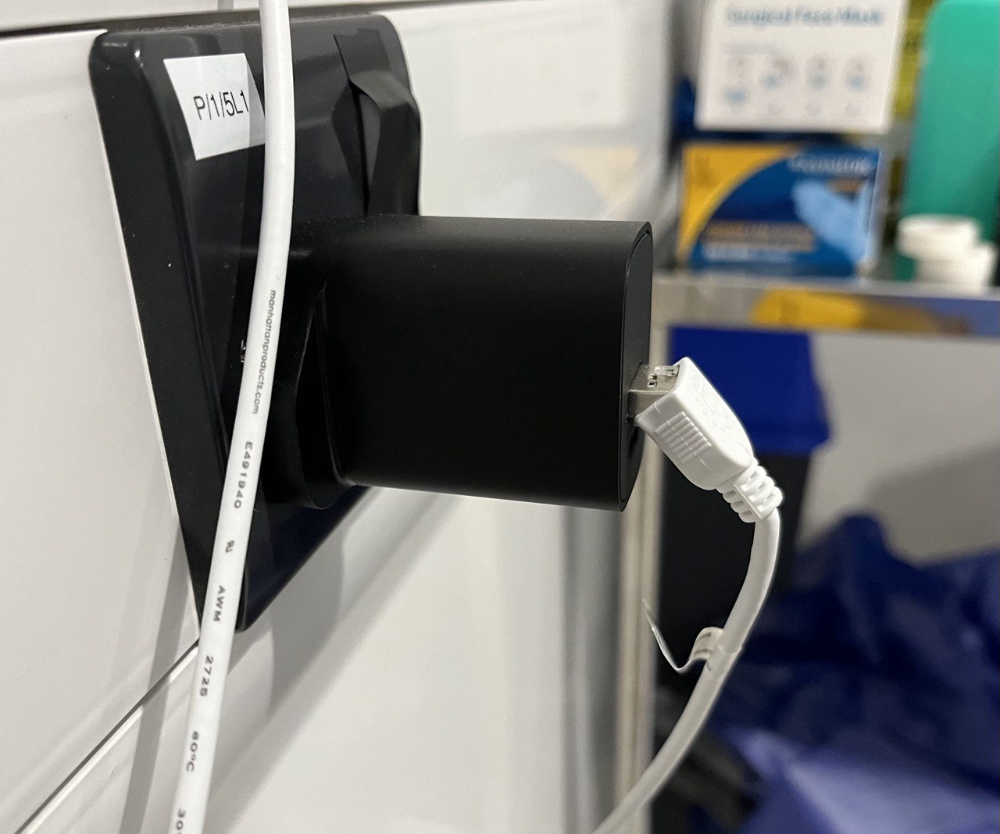

- Team debrief (it was a short one, Gabriela had to go out soon, meeting delayed until next week):
  - Some patients have to be advised to not drive after being treated.
  - There was a patient with missing scans (they had to repeat the process for the patient).
- Discussion with Ameen:
  - Cataract blood pressure only measured if an operation is due soon.
  - Unknown machines were identified and mapped to the floor plans.

- bx10 occupancy:
  - On 4:40:30
  - Off 4:42:05

- bx20 occupancy:
  - Off 4:35 pm

# BX2 visit 8/7/2024 

* People are still smoking in front of the Shopping Centre which causes the smoke to get it in.

* Bx22 occupancy:
  
  * 5:06:00 on
  * 5:36:50 off
  * 5:37:20 on
  * 5:38:15 off
  
  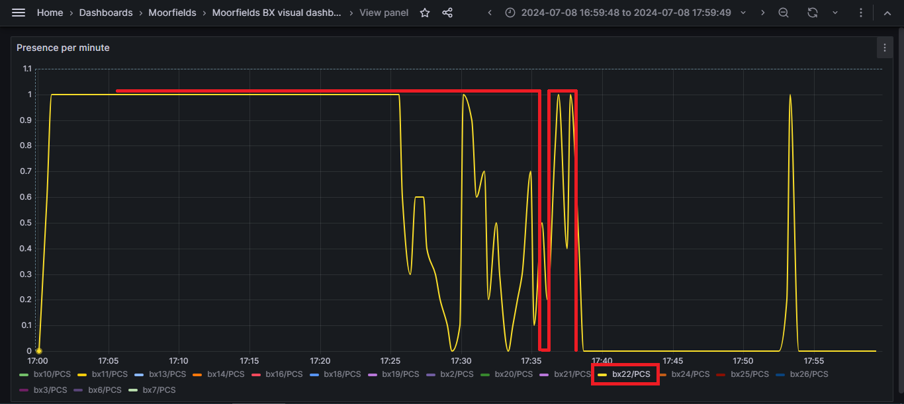

- Restarted 11, 1, 23, 5
- Changed malfunctioning HDC1080 of bx11. 

* Team debrief: 
  * Gabriela’s best time to ask questions is 4:30 pm everyday.
  * Gabriela will be the waiting for an email about my clinic layout questions.
  * The team were talking about doing the checks, where at BX1 one staff was assigned to do the checks, here the team could cycle this duty between them.
  * They were talking about system (optos). 
* Gabriela sometimes has hard time doing the check, she has to take pictures manually of the scans then sending them by email.
* Some patients ask about their situation after the scans. Gabriela said that the team should not give the last word (they’re not medically trained to do that). In this case, it’s good to reassure the patient <u>with emphasising</u> that the final word is for the doctor in the letter. It is also good to answer them when they ask if their numbers are in the normal range. 

# BX2 visit 27/6/2024 

- Restarted: 16, 20, 24, 25, 26, 3, 5, 7
- No damaged power adapters.
- Talked to staff about cubicle types (didn't attend the team briefing). 

* Bx19 occupancy:
  * On 5:18:00
  * Off 5:22:35
  * On 5:28:38
  * Off 5:42:42
  * On 5:49:55
  * Off 5:56:50

- A machine was put near BX16, I was worried it might blocked the mmWave field of view, but after testing I saw it was detecting me fine:

  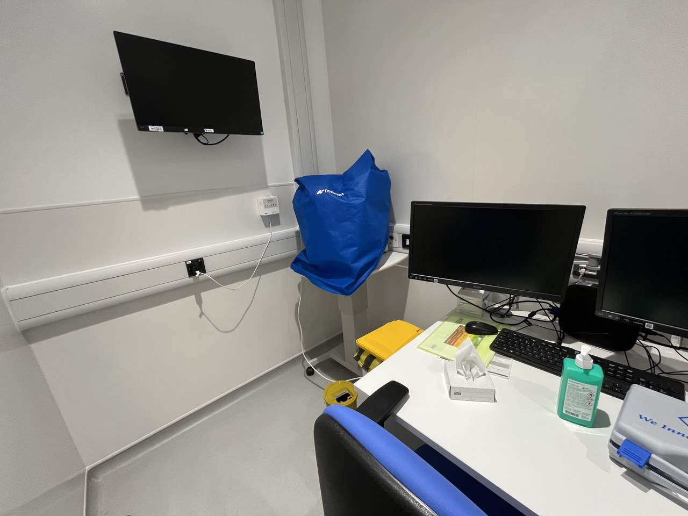

- Patient numbers:

  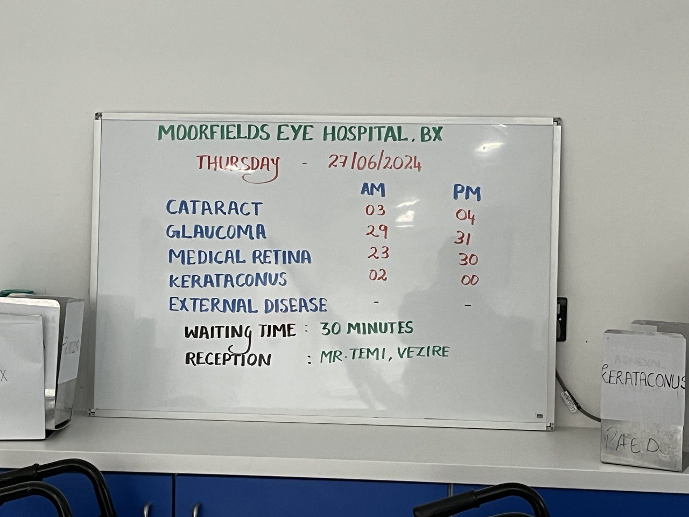

##### mmWave monitored windows analysis:

Note: sensor values less than 0.5 are treated as a no occupancy

| Window                                          | BX   | BX occupancy minutes | Real occupancy minutes | Difference        | Error %    |
| ----------------------------------------------- | ---- | -------------------- | ---------------------- | ----------------- | ---------- |
| [window 1](mmwave-comparisons/window1/bx13.png) | BX13 | 17 min               | 18 min                 | -1 min            | 5.6%       |
| [window 2](mmwave-comparisons/window2/bx1.png)  | BX1  | 11.5 min             | 12 min                 | -0.5 min          | 4.2%       |
| [window 2](mmwave-comparisons/window2/bx23.png) | BX23 | 16 min               | 16 min                 | 0 min             | 0%         |
| [window 3](mmwave-comparisons/window3/bx5.png)  | BX5  | 7.7 min              | 7.5 min                | +0.2 min          | 2.7%       |
| [window 4](mmwave-comparisons/window4/bx10.png) | BX10 | 12 min               | 8.5 min                | +3.5 min          | 41.2%      |
| [window 4](mmwave-comparisons/window4/bx13.png) | BX13 | 14.7 min             | 18.5 min               | -3.8 min          | 20.5%      |
| [window 4](mmwave-comparisons/window4/bx19.png) | BX19 | 18.5 min             | 17.8 min               | +0.7 min          | 4%         |
| [window 5](mmwave-comparisons/window5/bx23.png) | BX23 | 11.6 min             | 11.6 min               | 0 min             | 0%         |
| [window 7](mmwave-comparisons/window7/bx19.png) | BX19 | 40 min               | 25 min                 | +15 min           | 60%        |
| [window 8](mmwave-comparisons/window8/bx26.png) | BX26 | 14.8 min             | 16 min                 | -1.2 min          | 7.5%       |
| [window 9](mmwave-comparisons/window9/bx22.png) | BX22 | 32.1 min             | 31.9 min               | +0.2              | 0%         |
|                                                 |      |                      |                        | **Error Average** | **13.24%** |
|                                                 |      |                      |                        | **Accuracy**      | **86.75%** |

**Insights:**

- mmWave sensor accuracy: 86.75%
- False positives: 4/9
- False negatives: 4/9
- Correct windows: 3/9
- False positive is higher (19.4 min compared to 7.3 min false negative).

# BX2 visit 20/6/2024 

- Bx26

  5:00:00 on

  5:16:00 off

- Restarted bx16, 13, 21

- Replaced damaged power adapter 26

- Team debrief:
  - A patient came to the clinic and refused to be examined after attending! This means the patient would be treated as not attending. 
  - The next 6 months would be better regarding this problem. 

# BX2 visit 30/5/2024 

- Attended a team debrief.

- Restarted bx26, bx19, bx10

- Some patients like to have some chat with staff, ask questions and maybe thank the staff. Staff highlighted that although it takes time while other patients are waiting, but it’s good to let them have this chat.

- Although the smoking area has moved, smokers started to smoke in front of the centre (close to the old area), which causes some cigarette smell to get in the clinic. 

- Staff talked about the clinic being colder than expected. Turned out this is clearly visible on Grafana, and started two days ago:

  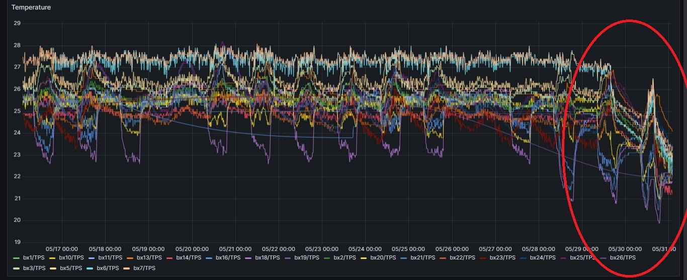

  After asking security, turned out someone has changed the temperature two days ago using the HVAC control panel:

  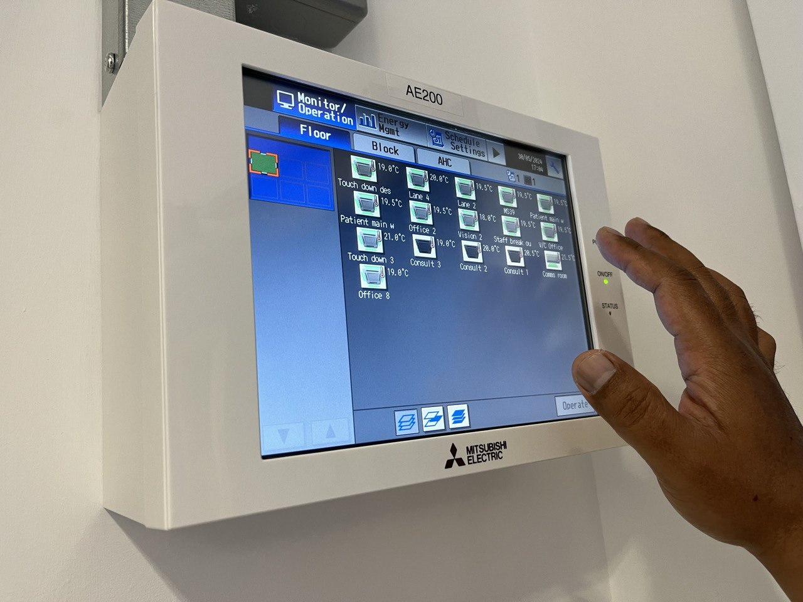

- Security also mentioned that the management asked him to turn the HVAC off during night to reduce bills. 

- Everyday the number of expected patients is written on this board in reception:

  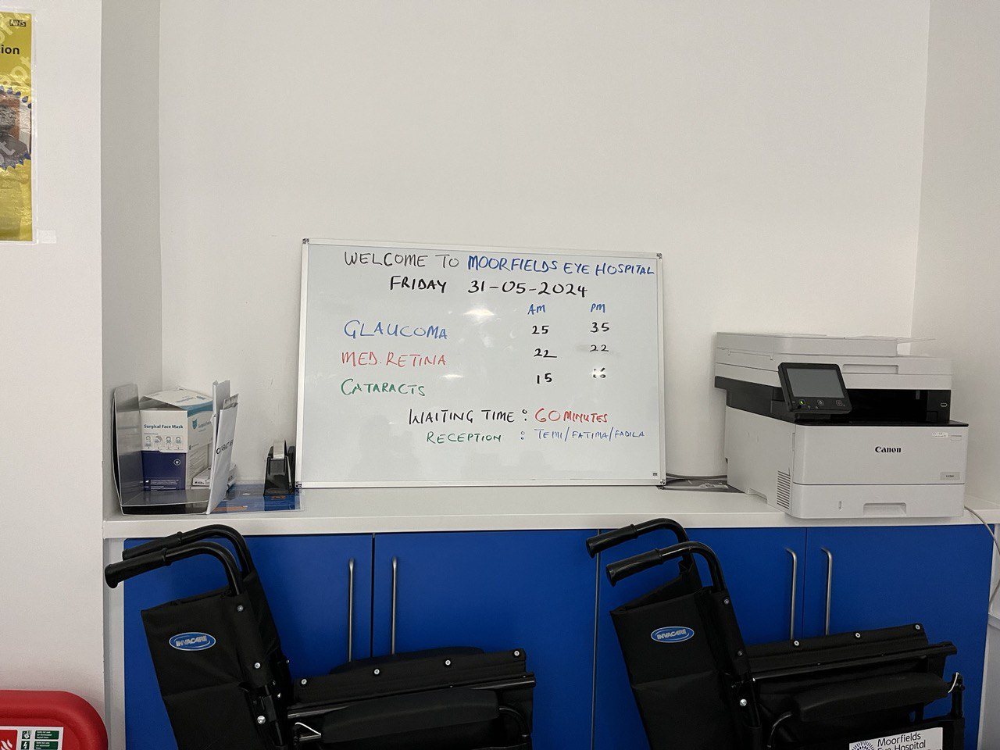

#### Useful info about staff numbers:

- There are 4 to 5 staff usually in VA.
- There are 2 to 3 staff usually in VF.
- There are 4 staff at Scans section [4.2] and 3 to 4 staff at Photos section [4.3] (they move the same patients).
- Cataract section only has 3 staff, those staff members are taken from the front side staff. 
- Normally there are 6-8 staff (technicians) in the clinic, they should be 13.
- Sometimes helping staff come to the clinic, this could happen on a Saturday. There are 8 to 10 staff on Saturday (helping staff may come on this day but rarely). 
- Monday is full house 10 to 11 staff. 
- New staff training takes 8 to 10 weeks, this includes shadowing, training and testing. 

# BX2 visit 23/5/2024 

- Restarted 18,16,23,21
- Attended a team debrief.

#### Useful info learned from staff:

* The clinic is divided into two sections, Glaucoma and Retina on the front side of the clinic, Cataract on the other side.

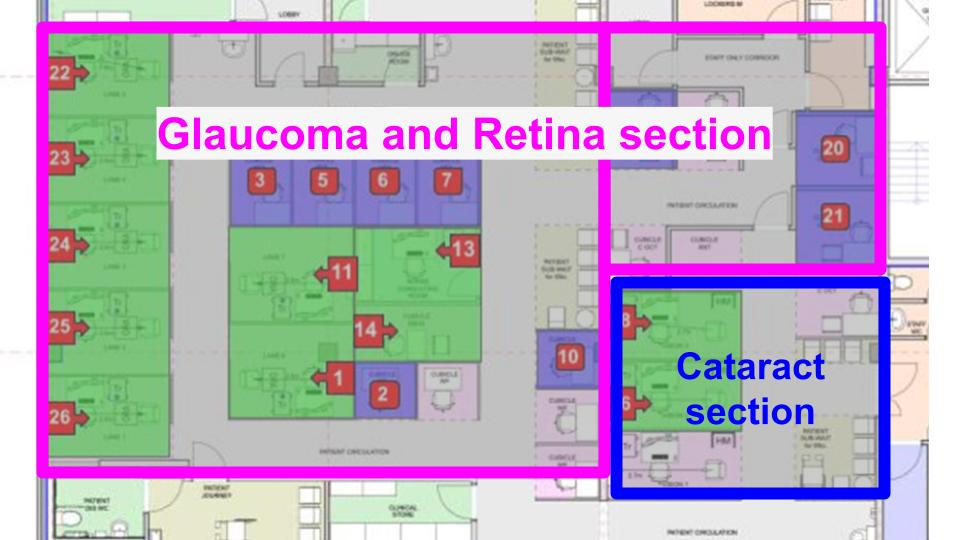

- The clinic has 100-110 patients per day.

- The Cataract section opens only 4 days a week (2 Saturdays a month). It has 20 patients max per day when it’s open. 

- This is a brief regarding the patient journey throughout the clinic:

  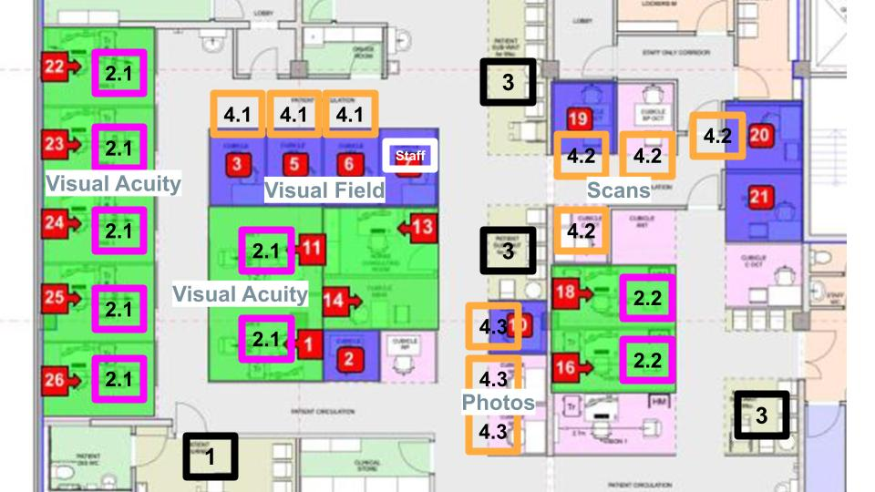

  - First, patients wait in the main reception [1]
  - Patients are called to VA (Visual Acuity), this depends on their condition, Glaucoma and Retina patients go to [2.1], Cataract patients go to [2.2].
  - Patients wait in waiting areas inside [3].
  - Patients go to either VF (Visual Field) [4.1] or scans [4.2] or photos [4.3].
  - Patient finish their journey and head to the reception again.

- Curtains status:
  - Each VA has its curtains closed all the time (for patient privacy, this includes sensitive questions and discussions). Lights are always on (sometimes are dimmed by staff). This applies on [2.1] and [2.2].
  - In other cubicles, closed curtains means an examination is going on. (My observation: not all the time curtains are closed).
  - VF cubicles [4.1] are 100% closed.
  - Scans cubicles [4.2] have their curtains closed 40% of the time.
  - Photos cubicles [4.3] curtains are 80% closed.
- Bx21 50% is used for less than 5 min.
- Bx7 only for staff, Bx3 to 6 are for patients.
- Some patients have hard conditions (in terms of mobility and interaction). Some patients with their relatives enter without telling staff about their deteriorating condition which stops and delays the examinations. 1 or 2 patients per day. 
- For example, having Dementia could cause a patient spending 200% time in VF compared to regular patients.

#### My ideas:

- Check examinations times in VF, see the average and outliers. 
- Todo: understand how each type of examinations are done.
- Q for next visit: how staff are distributed on cubicles?
- Todo: an intersection between light and presence could help. 
- Todo: Redesign Grafana dashboard to display all sensors for a certain cubicle.

# BX2 visit 16/5/2024 ~ 6 pm

- Restarted 26, 24, 22, 11, 1, 13, 6, 20
- Manually monitored cubicles: 19, 20, 23, 10, 13, 14, 3, 5 compared with mmWave values:

#### Window 4:

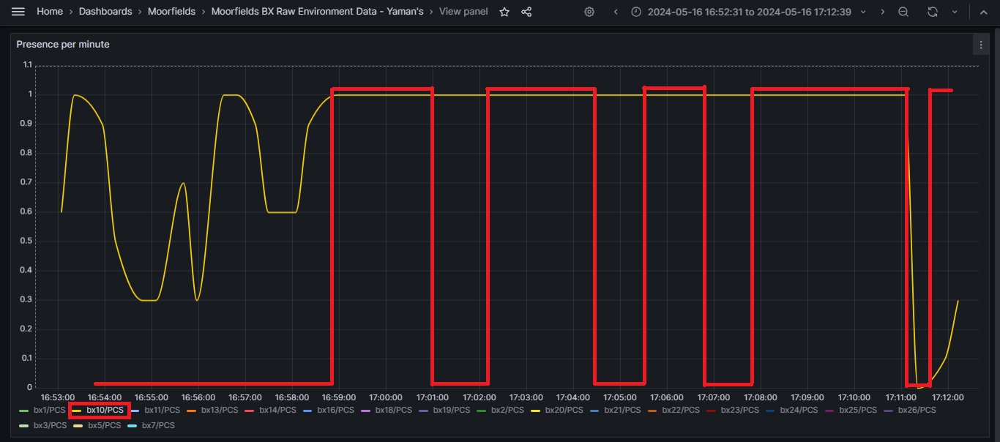

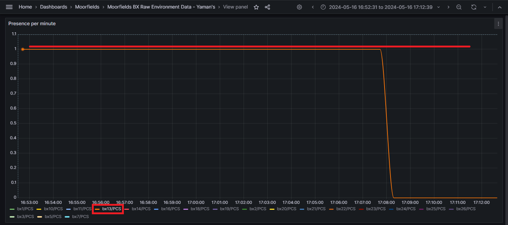

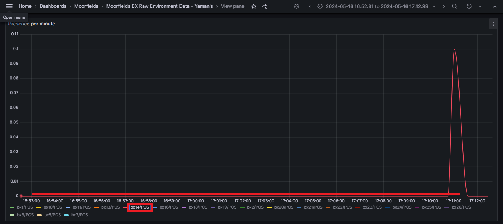

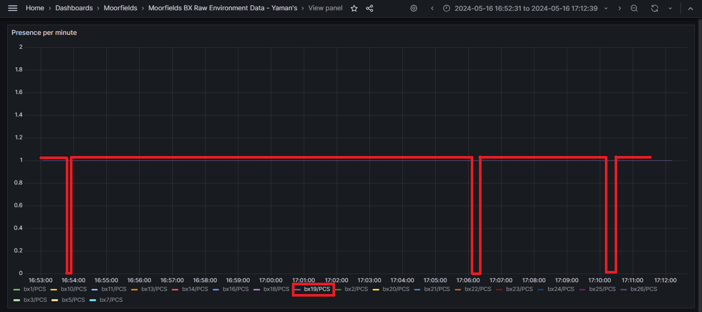

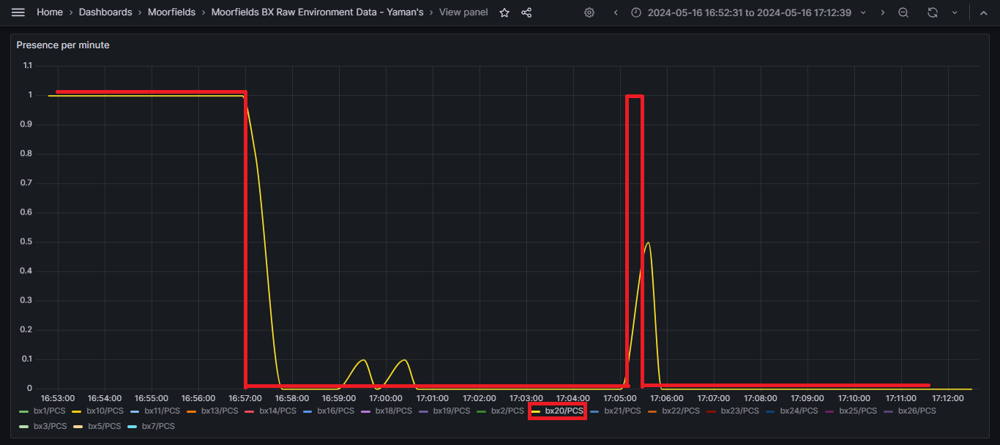

#### Window 5:

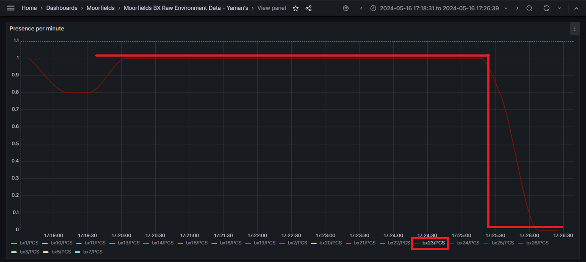

#### Window 6:

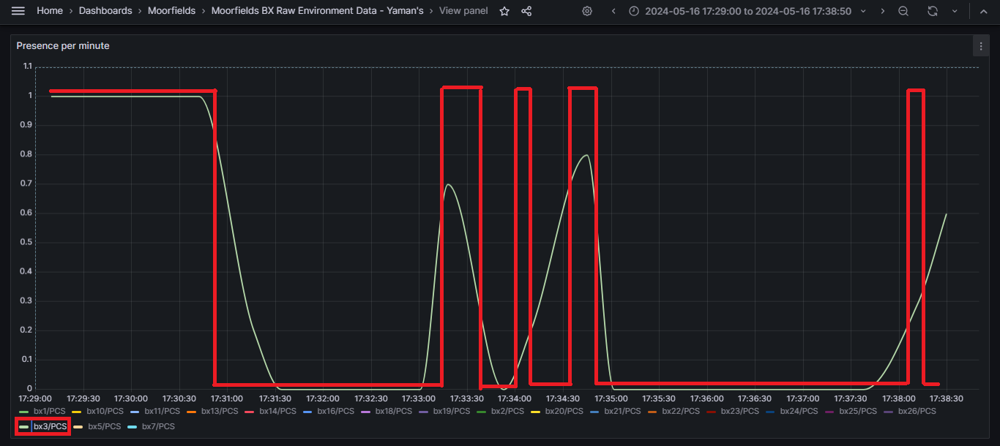

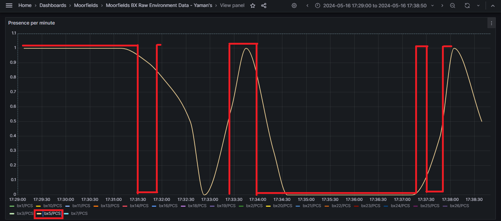

(This table was used for presence monitoring:)

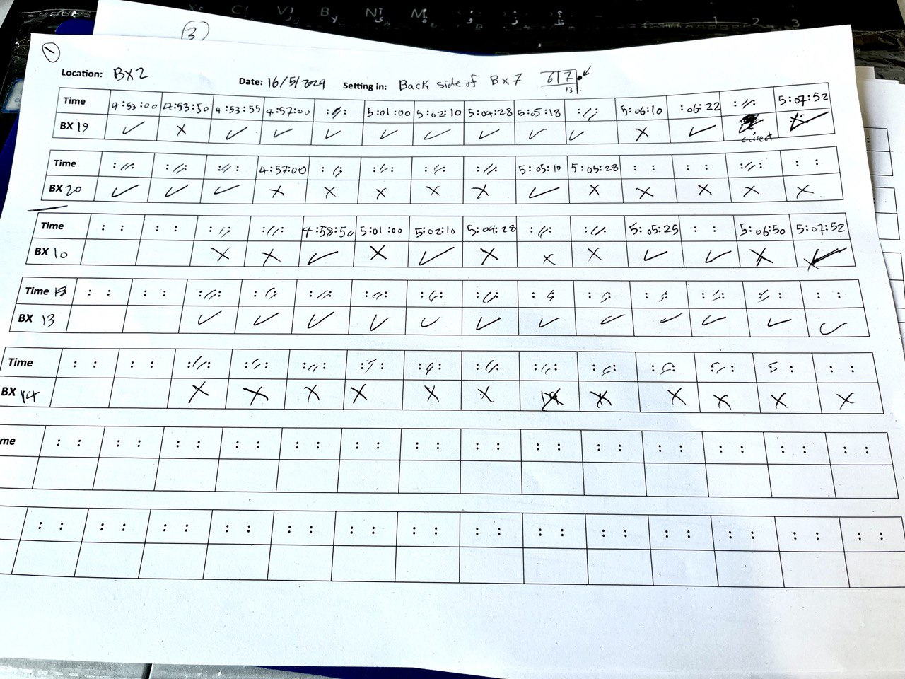

- The smoking bin has been removed near the air supply area, however, the staff told me that the number of people who smoke in this area was reduced but not totally gone:
  
- Some manually ambient measurements: 

| Location                    | Time | Testo CO2 | Testo Temperature |
| --------------------------- | ---- | --------- | ----------------- |
| main waiting area           | 5:41 | 748       | 23.2              |
| ambient air in bx25 cubicle | 5:43 | 878       | -                 |
| ambient air in bx11 cubicle | 5:44 | 905       |                   |
| ambient air in bx28 cubicle | 5:49 | 613       |                   |

* Temperature/Co2/Humidity comparison table:

| #    | BX name | Time of reading | CO2 BX | CO2 Testo | Humid BX | Humid Testo | Temp BX | Temp Testo | Temp diff |
| ---- | ------- | --------------- | ------ | --------- | -------- | ----------- | ------- | ---------- | --------- |
| 1    | Bx21    | 6:08            | 476    | 510       | 50.1     | 50.5        | 24.6    | 21.5       | 3.1       |
| 2    | Bx18    | 6:12            | 773    | 524       | 48.8     | 49.8        | 23.0    | 22.3       | 0.7       |
| 3    | Bx16    | 6:16            | 493    | 524       | 46       | 49.1        | 23.9    | 21.8       | 2.1       |
| 4    | Bx10    | 6:20            | 487    | 602       | 44.9     | 47.4        | 25.6    | 23.2       | 2.4       |
| 5    | Bx14    | 6:23            | 523    | 617       | 46.5     | 45.5        | 25.5    | 23.8       | 1.7       |
| 6    | Bx13    | 6:26            | 684    | 1784      | 47.7     | 51.1        | 27.4    | 24.4       | 3.0       |
| 7    | Bx19    | 6:29            | 1322   | 625       | 45.3     | 43.3        | 25.4    | 24.1       | 1.3       |
| 8    | Bx20    | 6:32            | 478    | 552       | 49.4     | 45.2        | 24.5    | 23.6       | 0.9       |
| 9    | Bx7     | 6:36            | 539    | 576       | 40.5     | 45.3        | 27.7    | 24.0       | 3.7       |
| 10   | Bx5     | 6:39            | 479    | 616       | 44.1     | 46.7        | 27.1    | 24.3       | 2.8       |
| 11   | Bx2     | 6:54            | 462    | 542       | 48.0     | 46.1        | 25.7    | 24.1       | 1.6       |
| 12   | Bx3     | 6:58            | 485    | 576       | 40.8     | 46.8        | 26.6    | 23.9       | 2.7       |
| 13   | Bx22    | 7:02            | 490    | 564       | 50.4     | 47.0        | 24.8    | 23.6       | 1.2       |
| 14   | Bx23    | 7:04            | 628    | 559       | 49.5     | 46.7        | 24.9    | 23.6       | 1.3       |
| 15   | Bx24    | 7:07            | 498    | 557       | 49.2     | 46.4        | 25.8    | 23.7       | 2.1       |
| 16   | Bx25    | 7:09            | 598    | 547       | 47.6     | 45.8        | 26.1    | 23.8       | 2.3       |
| 17   | Bx26    | 7:13            | 1537   | 533       | 47.8     | 45.5        | 25.7    | 23.9       | 1.8       |
| 18   | Bx1     | 7:16            | 1260   | 537       | 46.8     | 45.0        | 25.9    | 24.0       | 1.9       |
| 19   | Bx11    | 7:18            | 1015   | 536       | 45.0     | 45.3        | 25.8    | 24.1       | 1.7       |
| 20   | Bx6     | 7:27            | 531    | 538       | 40.7     | 44.1        | 27.1    | 24.5       | 2.6       |

**Temp diff average = 2.045**

# BX2 visit 9/5/2024 ~ 6:23 pm

- Restarted: 10, 11, 13, 16, 2, 20, 21, 22

- Manually monitored cubicles: bx3,4,6,7 compared with mmWave values:

  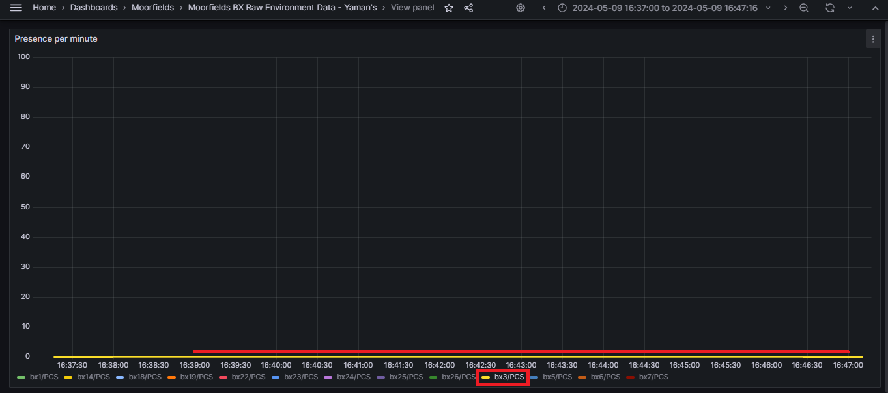

  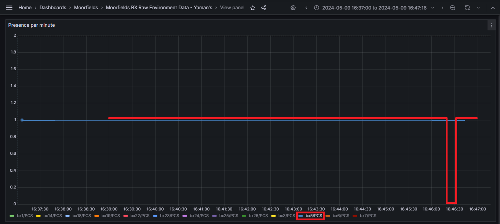

  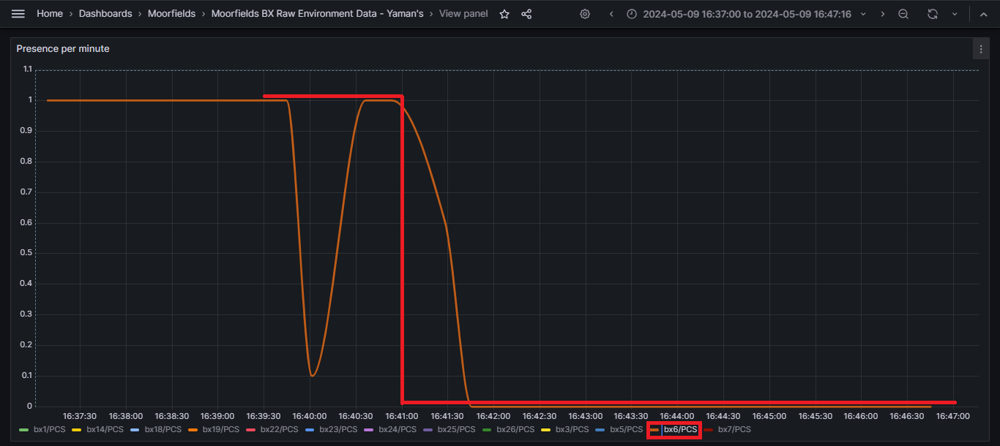

- Temperature/Co2/Humidity comparison table:

| #    | BX name/ reading name | Time of reading | Temp BX | Temp Testo | Temp diff | Humid BX | Humid Testo | CO2 BX | CO2 Testo |
| ---- | --------------------- | --------------- | ------- | ---------- | --------- | -------- | ----------- | ------ | --------- |
| 1    | Bx26                  | 6:35            | 26.8    | 24.9       | 1.9       | 39.5     | 37.1        | 498    | 474       |
| 2    | Bx25                  | 6:39            | 27.6    | 25.3       | 2.3       | 38.9     | 36.5        | 584    | 497       |
| 3    | Bx24                  | 6:43            | 27.4    | 25.3       | 2.1       | 40.1     | 36.5        | 501    | 488       |
| 4    | Bx23                  | 6:48            | 27.0    | 25.5       | 1.5       | 39.1     | 36.3        | 506    | 500       |
| 5    | Bx22                  | 6:53            | 25.6    | 25.0       | 0.6       | 41.4     | 36.9        | 488    | 502       |
| 6    | Bx3                   | 6:57            | 26.2    | 24.2       | 2.0       | 34.8     | 38.2        | 495    | 495       |
| 7    | Bx5                   | 7:00            | 25.8    | 24.0       | 1.8       | 39.2     | 38.4        | 479    | 485       |
| 8    | Bx6                   | 7:04            | 25.7    | 24.0       | 1.7       | 37.3     | 38.6        | 521    | 488       |
| 9    | Bx7                   | 7:10            | 26.5    | 23.9       | 2.6       | 36.3     | 39.4        | 518    | 488       |
| 10   | Bx13                  | 7:13            | 25.9    | 23.9       | 2.0       | 40.7     | 40.7        | 696    | 568       |
| 11   | Bx18                  | 7:16            | 23.4    | 23.1       | 0.3       | 43.3     | 41.9        | 730    | 481       |
| 12   | Bx16                  | 7:19            | 24.2    | 22.8       | 1.4       | 40.2     | 41.5        | 479    | 468       |
| 13   | Bx20                  | 7:22            | 23.9    | 22.8       | 1.1       | 44.8     | 41.9        | 493    | 502       |
| 14   | Bx19                  | 7:26            | 24.5    | 22.8       | 1.7       | 41.9     | 42.0        | 1187   | 502       |
| 15   | Bx14                  | 7:28            | 25.5    | 23.1       | 2.4       | 40.4     | 41.5        | 524    | 493       |

**Temp diff average = 1.69**

# BX2 visit 1/5/2024 ~ 6:20 pm

- Restarted: 13, 14, 18

- Re-deployed ceiling devices

- Temperature comparison: 
  Bx — Testo

  Bx20: 23.3 — 22.0

  Bx19: 24.4 — 23.5

  Bx3: 25.7  — 24.1

# BX2 visit 25/4/2024 ~ 5:40 pm	

- Replaced mmWave sensor in BX26 (it was a faulty sensor according to the last visit log)
- Re-deployed wall-mounted sensors (bx22, bx23, bx24, bx25, bx26, bx1, bx11, bx13, bx14, bx16, bx18).
- Took ceiling mounted sensors for maintenance. 
- Temperatre comparison between Testo probe and wall-mounted COACHes:

| #    | BX name | Time waiting for a reading | Temp BX | Temp Testo |
| ---- | ------- | -------------------------- | ------- | ---------- |
| 1    | Bx16    | 4 min                      | 25.2    | 22.8       |
| 2    | Bx18    | 1 min                      | 24.8    | 22.9       |
| 3    | Bx26    | 3 min                      | 24.9    | 22.9       |
| 4    | Bx25    | 1 min                      | 25.5    | 23.1       |
| 5    | Bx24    | 1 min                      | 25.5    | 23.4       |
| 6    | Bx13    | 1 min                      | 25.4    | 23.5       |

# BX2 visit 18/4/2024 ~ 5:19 pm

- Restarted:  bx26, bx2, bx10, bx20, bx21, bx18, and bx16

- Generated manual presence charts:
  
#### Time window1:

  

####   Time window 2:

  

  

  

  

  

- Talked to staff about temperature problems, this the discussion brief:

  - Offices near staff area are colder than the rest of the clinic.
  - The area in front of bx16 & bx18 is colder than the rest of the clinic (also has more cigarettes smoke).
  - Those days are most busy in the clinic: Monday, Wednesday, and Friday.
  - March was quite busy, one day we had so many waiting patients so they had to wait on floor (no seating spaces left).

- More broken adapters in bx26 and bx18, they were fixed by strong tape. To be replaced once we get the new ordered adapters.

- Someone has pulled off and re-attached bx1 using the strip commands. 

- CO2, temp, humidity readings validations started at 5:40, Testo probe was positioned near each COACH box as shown in the following photo, for the ceiling mounted boxes, Testo probe was positioned directly below it on a table.

  

   

| #    | BX name/ reading name     | Time of reading | Temp BX | Temp Testo | Temp diff | Humid BX | Humid Testo | CO2 BX | CO2 Testo |
| ---- | ------------------------- | --------------- | ------- | ---------- | --------- | -------- | ----------- | ------ | --------- |
| 1    | Bx14                      | 5:52 pm         | 26.2    | 23.1       | 3.1       | 25.4     | 27.3        | 1384   | 526       |
| 2    | Bx10                      | 5:57 pm         | 27.5    | 23.2       | 4.3       | 22.8     | 27.4        | 459    | 528       |
| 3    | Bx13                      | 6:02            | 26.9    | 23.8       | 3.1       | 29.4     | 30.9        | 669    | 866       |
| 4    | Bx2                       | 6:04            | 27.0    | 23.8       | 3.2       | 27.6     | 26.5        | 461    | 545       |
| 5    | Bx1                       | 6:07            | 26.6    | 23.7       | 2.9       | 26.3     | 26.7        | 1656   | 510       |
| 6    | Bx11                      | 6:17            | 26.1    | 24.5       | 1.6       | 25.2     | 25.7        | 559    | 509       |
| 7    | Bx3                       | 6:21            | 27.1    | 24.3       | 2.8       | 21.6     | 26.2        | 511    | 499       |
| 8    | Bx5                       | 6:29            | 27.3    | 24.0       | 3.3       | 25.1     | 26.3        | 491    | 489       |
| 9    | Bx6                       | 6:33            | 27.1    | 23.7       | 3.4       | 23.0     | 26.5        | 525    | 490       |
| 10   | Bx7                       | 6:36            | 27.8    | 23.7       | 2.2       | 21.3     | 26.6        | 551    | 495       |
| 11   | Bx22                      | 6:39            | 25.7    | 23.5       | 2.2       | 29.1     | 27.3        | 474    | 504       |
| 12   | Bx23                      | 6:42            | 27.3    | 23.8       | 3.5       | 27.2     | 26.7        | 491    | 500       |
| 13   | Bx24                      | 6:46            | 27.4    | 24.5       | 2.9       | 28.6     | 26.6        | 499    | 511       |
| 14   | Bx25                      | 6:49            | 27.4    | 24.8       | 2.6       | 27.3     | 25.5        | 581    | 497       |
| 15   | Bx26                      | 6:54            | 26.7    | 24.6       | 2.1       | 26.6     | 24.1        | 513    | 456       |
| 16   | Bx19 (I felt colder here) | 7:03            | 24.7    | 22.8       | 1.9       | 25.8     | 26.1        | 510    | 466       |
| 17   | Bx20 (I felt colder here) | 7:05            | 23.7    | 22.5       | 1.2       | 29.1     | 28.8        | 494    | 475       |
| 18   | Bx21                      | 7:18            | 26.2    | 22.2       | 4         | 26.7     | 27.2        | 566    | 553       |
| 19   | Bx18                      | 7:20            | 24.6    | 22.5       | 2.1       | 24.4     | 26.3        | 749    | 487       |
| 20   | Bx16                      | 7:25            | 25.8    | 23.1       | 2.7       | 22.5     | 26.1        | 507    | 487       |

Temp diff average: 2.755

##### Auxiliary readings:

| #    | BX name/ reading name             | Time of reading | Temp BX | Temp Testo | Humid BX | Humid Testo | CO2 BX | CO2 Testo |
| ---- | --------------------------------- | --------------- | ------- | ---------- | -------- | ----------- | ------ | --------- |
| 1    | Ambient corridor near Bx2         |                 |         | 23.8       |          | 26.5        |        |           |
| 7    | Bx1 Testo probe in touch with box |                 | 26.6    | 24.5       |          |             |        |           |

# BX2 visit 11/4/2024 ~ 5:30 pm

1. Restarted bx25 (was offline)
2. Restarted bx26 (mmWave was always 0)
3. Restarted bx18 several times (was offline)
4. Restarted bx20 (was offline)
5. Restarted bx21 (was offline)
6. All presence values were checked
7. No broken parts.
8. CO2 validation from 5:30 pm to 6:45 pm, no smoke smell:

| BX   | CO2 reading - COACH | CO2 reading Testo | 12 hrs valid reading changes |
| ---- | ------------------- | ----------------- | ---------------------------- |
| bx2  | 468                 | 594               | NO                           |
| bx1  | 1738                | 551               | YES                          |
| bx11 | 640                 | 556               | YES                          |
| bx3  | 520                 | 565               | NO                           |
| bx5  | 482                 | 550               | NO                           |
| bx6  | 529                 | 545               | NO                           |
| bx7  | 540                 | 542               | NO                           |
| bx13 | 638                 | 614               | NO                           |
| bx14 | 1368                | 533               | YES                          |
| bx10 | 462                 | 523               | NO                           |
| bx26 | 470                 | 514               | YES                          |
| bx25 | 567                 | 513               | NO                           |
| bx24 | 488                 | 511               | NO                           |
| bx23 | 1326                | 512               | YES                          |
| bx22 | 481                 | 525               | NO                           |
| bx19 | 512                 | 494               | NO                           |
| bx20 | 492                 | 483               | NO                           |
| bx16 | 597                 | 448               | YES                          |
| bx18 | 488                 | 445               | NO                           |
| bx21 | 456                 | 449               | NO                           |

# BX2 visit 25/3/2022 @ ~5:45 pm

1. All boxes were restarted, all of them were offline except bx2.
2. CO2 readings:

Bx — testo

bx16: 630 — 570

bx18: 486 — 520

bx26: 1737 — 957

bx25: 566 — 907

bx24: 481 — 965

bx23: 1868 — 980

bx22: 485 — 1008

bx1: 2082 — 908

bx11: 884 — 951

bx14: 1656 — 824

bx13: 595 — 711

3. Smoking won’t affect the CO2 levels! There was a smoking smell in bx18  and bx16 area at the time of taking readings, but CO2 levels seemed not affected.

# BX2 visit 14/3/2022 @ ~4 pm

1. Restarted bx21 & bx16
2. Changed broken plug of bx22
3. Got info from staff that cigarette smoke is low or non existing today (felt it myself). Also they said smoke tends to be high on Monday and Tuesday, less on the other days of the week. And also less if it’s raining outside (because smokers can't use the smoking area in this case).
4. Less patients than usual today, staff told me that's the site is under-booked due to management process...
5. Explained by staff: patients usually start coming into the waiting area at 9 am, they start getting into cubicles at 10 am. Usually, all patients are out by 5 pm, only cleaning staff remains after that until 8 pm.
6. The shopping centre opens at 9 am and closes at 9 pm.

# BX2 visit 7/3/2022 @ ~ 4 pm

1. Restarted bx24
2. Plugged in bx23 (was unplugged partially).
3. Changed broken adapter of bx1

4. New sticker has been put on all wall-mounted boxes
5. As a summary: Two boxes were offline; one semi-unplugged and one needed reboot. The rest stayed online from last week, which is surprisingly good – probably because there were no network breakdowns.
6. Cigarette smoke has gotten worse, it’s all over the clinic today. The staff showed me the supply vent which is directly above the smoking area.

They put a completely hidden non-smoking sign on one side and left the smoking bin on the other side, so smokers are still using it as usual.

It’s literally very annoying to stay here for more than one hour because of this.

7. More patients in the waiting areas today compared to last week. Saw one of them wondering around the clinic trying to ask when their turn is going to be after waiting 1.5h.
8. Presence validation is done, we have bx26 with a faulty mmWave sensor that doesn’t match the usage state, it worked well after a restart.

# BX2 visit 29/2/2024 @ ~4 pm

1. Changed broken plug of bx22

2. Network is fine, I was surprised all of them were not connected. Just restarted them one by one.

3. For data analysis later; I smelled cigarette smoke every time I was around this area. Staff also complained about this and thought someone was smoking, turned out the supply shaft of the HVAC system in the highlighted area on the map is positioned directly above the smoking area of Brent Cross shopping centre!
   Vasili knew about this and they are trying now to change the location of the smoking area or extend the shaft itself.
   This could affect our CO2 readings I think.

   

   

4. Also did some monitoring for these cubicles, mmWave and sound sensors seem to match the usage state
   
   