# BX2 visit 9/5/2024 ~ 6:23 pm

- Restarted: 10, 11, 13, 16, 2, 20, 21, 22, 

- Manually monitored cubicles: 3,4,6,7 to compare mmWave values (To be inserted later).
- Temperature/Co2/Humidity comparison table:

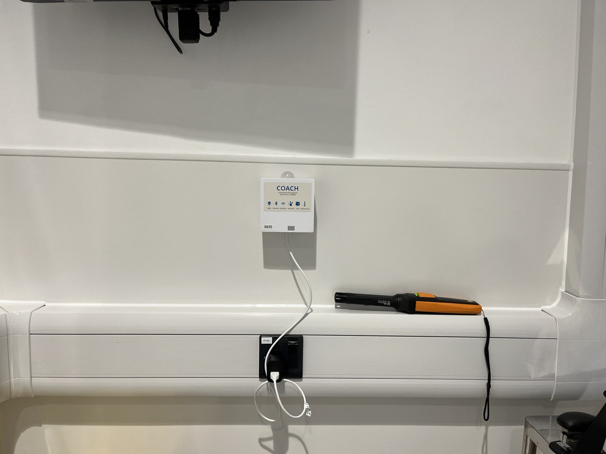

| #    | BX name/ reading name | Time of reading | Temp BX | Temp Testo | Humid BX | Humid Testo | CO2 BX | CO2 Testo |
| ---- | --------------------- | --------------- | ------- | ---------- | -------- | ----------- | ------ | --------- |
| 1    | Bx26                  | 6:35            | 26.8    | 24.9       | 39.5     | 37.1        | 498    | 474       |
| 2    | Bx25                  | 6:39            | 27.6    | 25.3       | 38.9     | 36.5        | 584    | 497       |
| 3    | Bx24                  | 6:43            | 27.4    | 25.3       | 40.1     | 36.5        | 501    | 488       |
| 4    | Bx23                  | 6:48            | 27.0    | 25.5       | 39.1     | 36.3        | 506    | 500       |
| 5    | Bx22                  | 6:53            | 25.6    | 25.0       | 41.4     | 36.9        | 488    | 502       |
| 6    | Bx3                   | 6:57            | 26.2    | 24.2       | 34.8     | 38.2        | 495    | 495       |
| 7    | Bx5                   | 7:00            | 25.8    | 24.0       | 39.2     | 38.4        | 479    | 485       |
| 8    | Bx6                   | 7:04            | 25.7    | 24.0       | 37.3     | 38.6        | 521    | 488       |
| 9    | Bx7                   | 7:10            | 26.5    | 23.9       | 36.3     | 39.4        | 518    | 488       |
| 10   | Bx13                  | 7:13            | 25.9    | 23.9       | 40.7     | 40.7        | 696    | 568       |
| 11   | Bx18                  | 7:16            | 23.4    | 23.1       | 43.3     | 41.9        | 730    | 481       |
| 12   | Bx16                  | 7:19            | 24.2    | 22.8       | 40.2     | 41.5        | 479    | 468       |
| 13   | Bx20                  | 7:22            | 23.9    | 22.8       | 44.8     | 41.9        | 493    | 502       |
| 14   | Bx19                  | 7:26            | 24.5    | 22.8       | 41.9     | 42.0        | 1187   | 502       |
| 15   | Bx14                  | 7:28            | 25.5    | 23.1       | 40.4     | 41.5        | 524    | 493       |

# BX2 visit 1/5/2024 ~ 6:20 pm

- Restarted: 13, 14, 18

- Re-deployed ceiling devices

- Temperature comparison: 
  Bx — Testo

  Bx20: 23.3 — 22.0

  Bx19: 24.4 — 23.5

  Bx3: 25.7  — 24.1

# BX2 visit 25/4/2024 ~ 5:40 pm	

- Replaced mmWave sensor in BX26 (it was a faulty sensor according to the last visit log)
- Re-deployed wall-mounted sensors (bx22, bx23, bx24, bx25, bx26, bx1, bx11, bx13, bx14, bx16, bx18).
- Took ceiling mounted sensors for maintenance. 
- Temperatre comparison between Testo probe and wall-mounted COACHes:

| #    | BX name | Time waiting for a reading | Temp BX | Temp Testo |
| ---- | ------- | -------------------------- | ------- | ---------- |
| 1    | Bx16    | 4 min                      | 25.2    | 22.8       |
| 2    | Bx18    | 1 min                      | 24.8    | 22.9       |
| 3    | Bx26    | 3 min                      | 24.9    | 22.9       |
| 4    | Bx25    | 1 min                      | 25.5    | 23.1       |
| 5    | Bx24    | 1 min                      | 25.5    | 23.4       |
| 6    | Bx13    | 1 min                      | 25.4    | 23.5       |

# BX2 visit 18/4/2024 ~ 5:19 pm

- Restarted:  bx26, bx2, bx10, bx20, bx21, bx18, and bx16

- Generated manual presence charts:
  Time window1:

  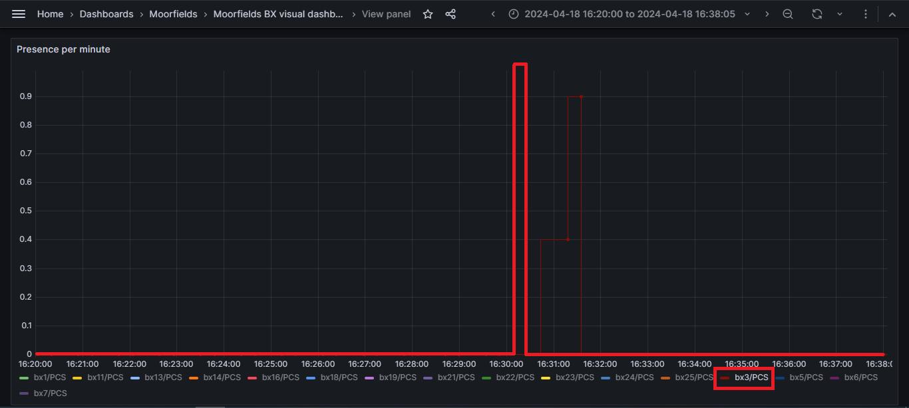

  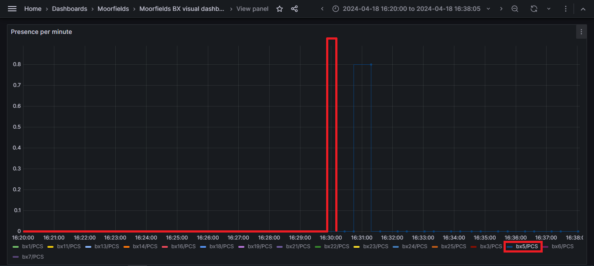

  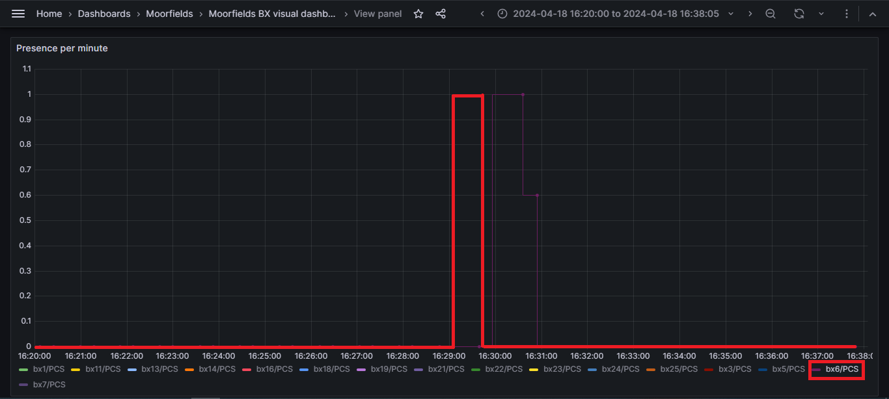

  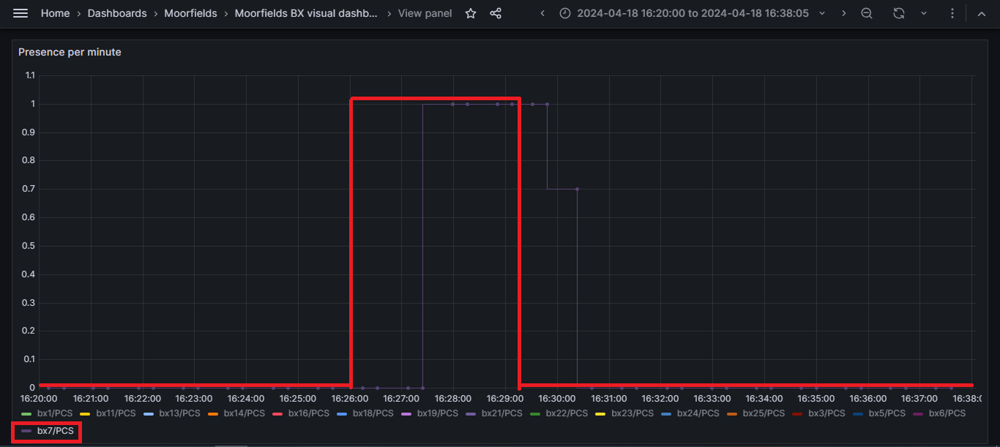

  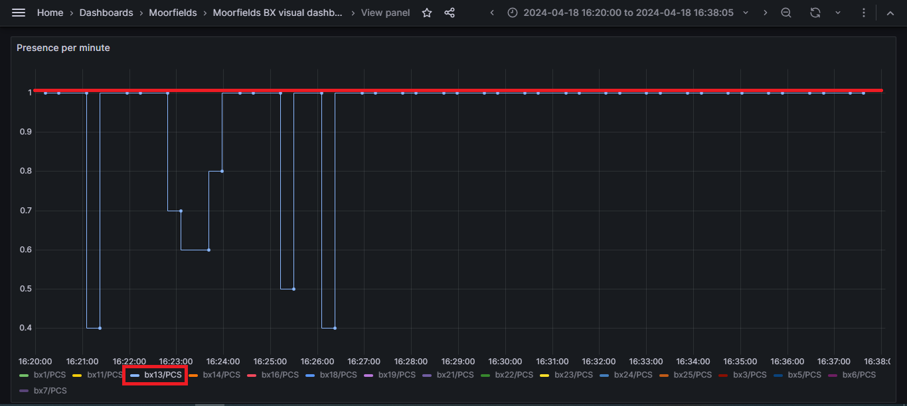

  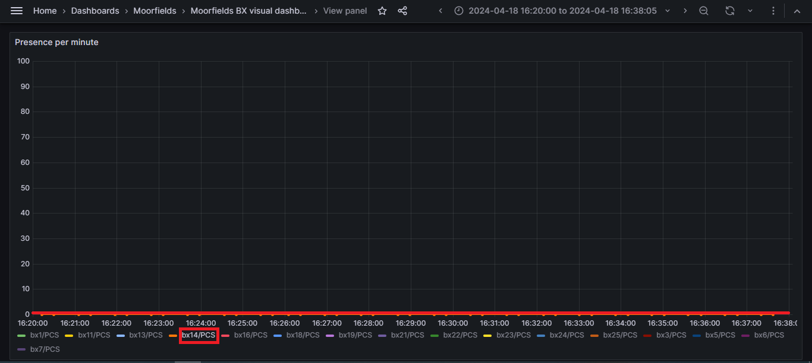

  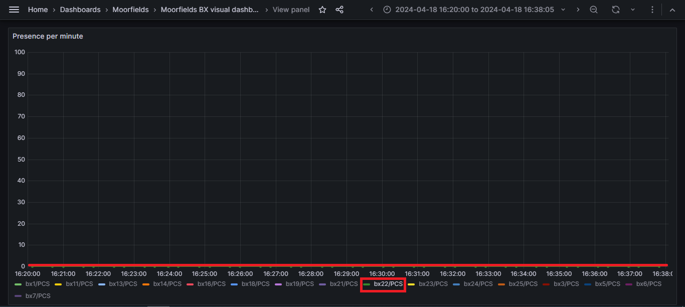

  Time window 2:

  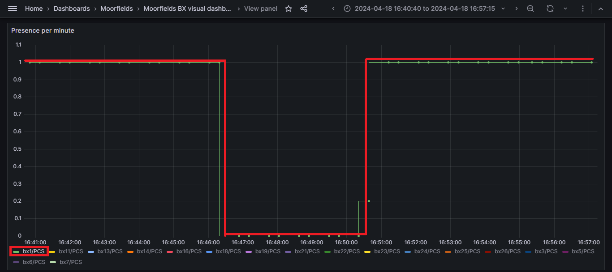

  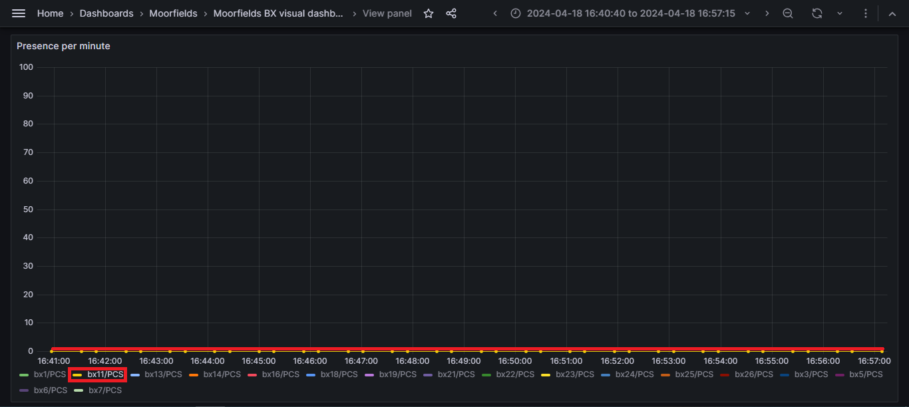

  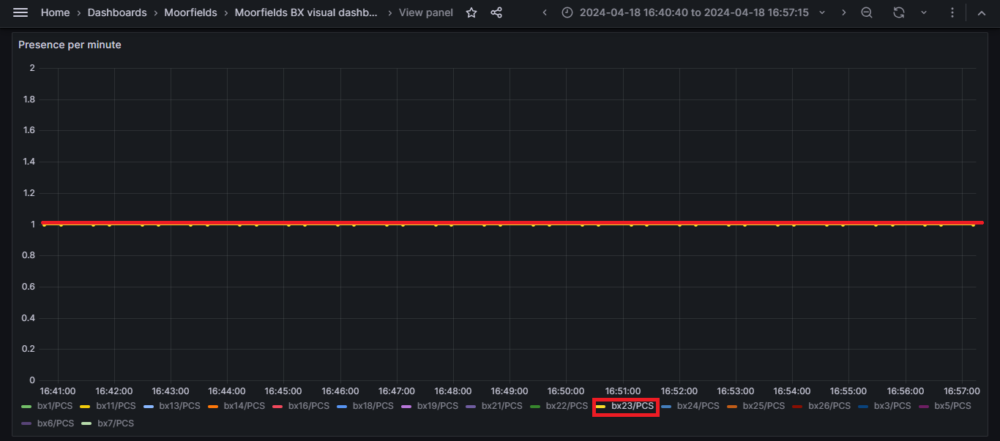

  

  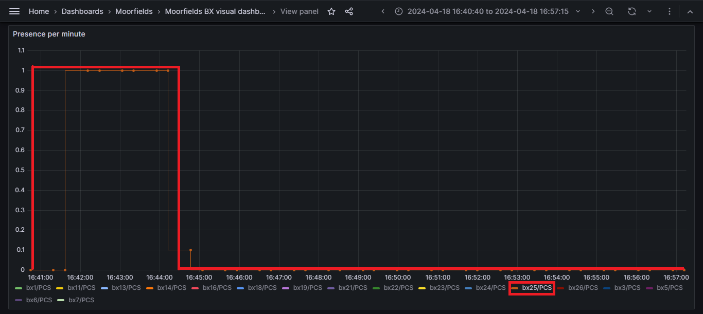

  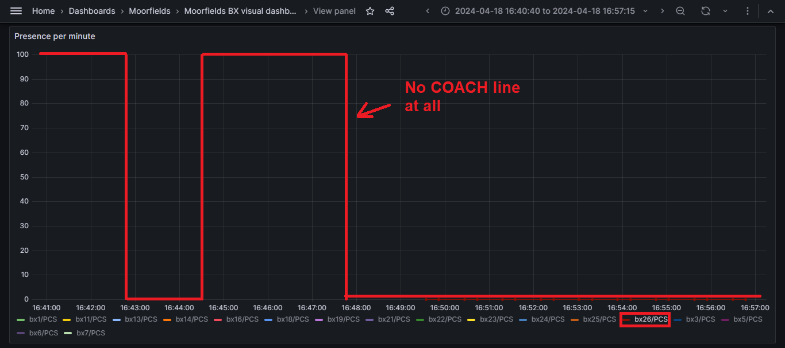

- Talked to staff about temperature problems, this the discussion brief:

  - Offices near staff area are colder than the rest of the clinic.
  - The area in front of bx16 & bx18 is colder than the rest of the clinic (also has more cigarettes smoke).
  - Those days are most busy in the clinic: Monday, Wednesday, and Friday.
  - March was quite busy, one day we had so many waiting patients so they had to wait on floor (no seating spaces left).

- More broken adapters in bx26 and bx18, they were fixed by strong tape. To be replaced once we get the new ordered adapters.

- Someone has pulled off and re-attached bx1 using the strip commands. 

- CO2, temp, humidity readings validations started at 5:40, Testo probe was positioned near each COACH box as shown in the following photo, for the ceiling mounted boxes, Testo probe was positioned directly below it on a table.

  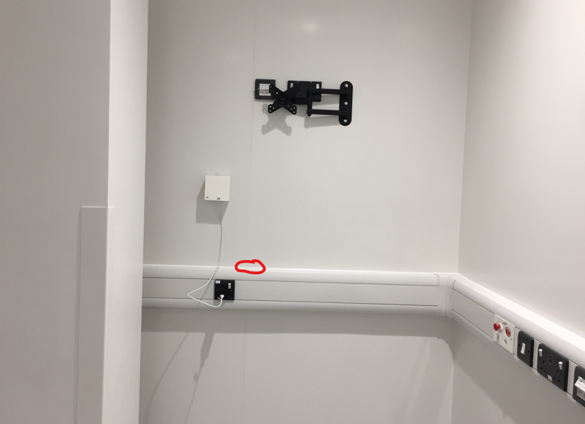

   

| #    | BX name/ reading name     | Time of reading | Temp BX | Temp Testo | Humid BX | Humid Testo | CO2 BX | CO2 Testo |
| ---- | ------------------------- | --------------- | ------- | ---------- | -------- | ----------- | ------ | --------- |
| 1    | Bx14                      | 5:52 pm         | 26.2    | 23.1       | 25.4     | 27.3        | 1384   | 526       |
| 2    | Bx10                      | 5:57 pm         | 27.5    | 23.2       | 22.8     | 27.4        | 459    | 528       |
| 3    | Bx13                      | 6:02            | 26.9    | 23.8       | 29.4     | 30.9        | 669    | 866       |
| 4    | Bx2                       | 6:04            | 27.0    | 23.8       | 27.6     | 26.5        | 461    | 545       |
| 6    | Bx1                       | 6:07            | 26.6    | 23.7       | 26.3     | 26.7        | 1656   | 510       |
| 8    | Bx11                      | 6:17            | 26.1    | 24.5       | 25.2     | 25.7        | 559    | 509       |
| 9    | Bx3                       | 6:21            | 27.1    | 24.3       | 21.6     | 26.2        | 511    | 499       |
| 10   | Bx5                       | 6:29            | 27.3    | 24.0       | 25.1     | 26.3        | 491    | 489       |
| 11   | Bx6                       | 6:33            | 27.1    | 23.7       | 23.0     | 26.5        | 525    | 490       |
| 12   | Bx7                       | 6:36            | 27.8    | 23.7       | 21.3     | 26.6        | 551    | 495       |
| 13   | Bx22                      | 6:39            | 25.7    | 23.5       | 29.1     | 27.3        | 474    | 504       |
| 14   | Bx23                      | 6:42            | 27.3    | 23.8       | 27.2     | 26.7        | 491    | 500       |
| 15   | Bx24                      | 6:46            | 27.4    | 24.5       | 28.6     | 26.6        | 499    | 511       |
| 16   | Bx25                      | 6:49            | 27.4    | 24.8       | 27.3     | 25.5        | 581    | 497       |
| 17   | Bx26                      | 6:54            | 26.7    | 24.6       | 26.6     | 24.1        | 513    | 456       |
| 18   | Bx19 (I felt colder here) | 7:03            | 24.7    | 22.8       | 25.8     | 26.1        | 510    | 466       |
| 19   | Bx20 (I felt colder here) | 7:05            | 23.7    | 22.5       | 29.1     | 28.8        | 494    | 475       |
| 20   | Bx21                      | 7:18            | 26.2    | 22.2       | 26.7     | 27.2        | 566    | 553       |
| 21   | Bx18                      | 7:20            | 24.6    | 22.5       | 24.4     | 26.3        | 749    | 487       |
| 22   | Bx16                      | 7:25            | 25.8    | 23.1       | 22.5     | 26.1        | 507    | 487       |

Auxiliary readings:

| #    | BX name/ reading name             | Time of reading | Temp BX | Temp Testo | Humid BX | Humid Testo | CO2 BX | CO2 Testo |
| ---- | --------------------------------- | --------------- | ------- | ---------- | -------- | ----------- | ------ | --------- |
| 1    | Ambient corridor near Bx2         |                 |         | 23.8       |          | 26.5        |        |           |
| 7    | Bx1 Testo probe in touch with box |                 | 26.6    | 24.5       |          |             |        |           |

# BX2 visit 11/4/2024 ~ 5:30 pm

1. Restarted bx25 (was offline)
2. Restarted bx26 (mmWave was always 0)
3. Restarted bx18 several times (was offline)
4. Restarted bx20 (was offline)
5. Restarted bx21 (was offline)
6. All presence values were checked
7. No broken parts.
8. CO2 validation from 5:30 pm to 6:45 pm, no smoke smell:

| BX   | CO2 reading - COACH | CO2 reading Testo | 12 hrs valid reading changes |
| ---- | ------------------- | ----------------- | ---------------------------- |
| bx2  | 468                 | 594               | NO                           |
| bx1  | 1738                | 551               | YES                          |
| bx11 | 640                 | 556               | YES                          |
| bx3  | 520                 | 565               | NO                           |
| bx5  | 482                 | 550               | NO                           |
| bx6  | 529                 | 545               | NO                           |
| bx7  | 540                 | 542               | NO                           |
| bx13 | 638                 | 614               | NO                           |
| bx14 | 1368                | 533               | YES                          |
| bx10 | 462                 | 523               | NO                           |
| bx26 | 470                 | 514               | YES                          |
| bx25 | 567                 | 513               | NO                           |
| bx24 | 488                 | 511               | NO                           |
| bx23 | 1326                | 512               | YES                          |
| bx22 | 481                 | 525               | NO                           |
| bx19 | 512                 | 494               | NO                           |
| bx20 | 492                 | 483               | NO                           |
| bx16 | 597                 | 448               | YES                          |
| bx18 | 488                 | 445               | NO                           |
| bx21 | 456                 | 449               | NO                           |

# BX2 visit 25/3/2022 @ ~5:45 pm

1. All boxes were restarted, all of them were offline except bx2.
2. CO2 readings:

Bx — testo

bx16: 630 — 570

bx18: 486 — 520

bx26: 1737 — 957

bx25: 566 — 907

bx24: 481 — 965

bx23: 1868 — 980

bx22: 485 — 1008

bx1: 2082 — 908

bx11: 884 — 951

bx14: 1656 — 824

bx13: 595 — 711

3. Smoking won’t affect the CO2 levels! There was a smoking smell in bx18  and bx16 area at the time of taking readings, but CO2 levels seemed not affected.

# BX2 visit 14/3/2022 @ ~4 pm

1. Restarted bx21 & bx16
2. Changed broken plug of bx22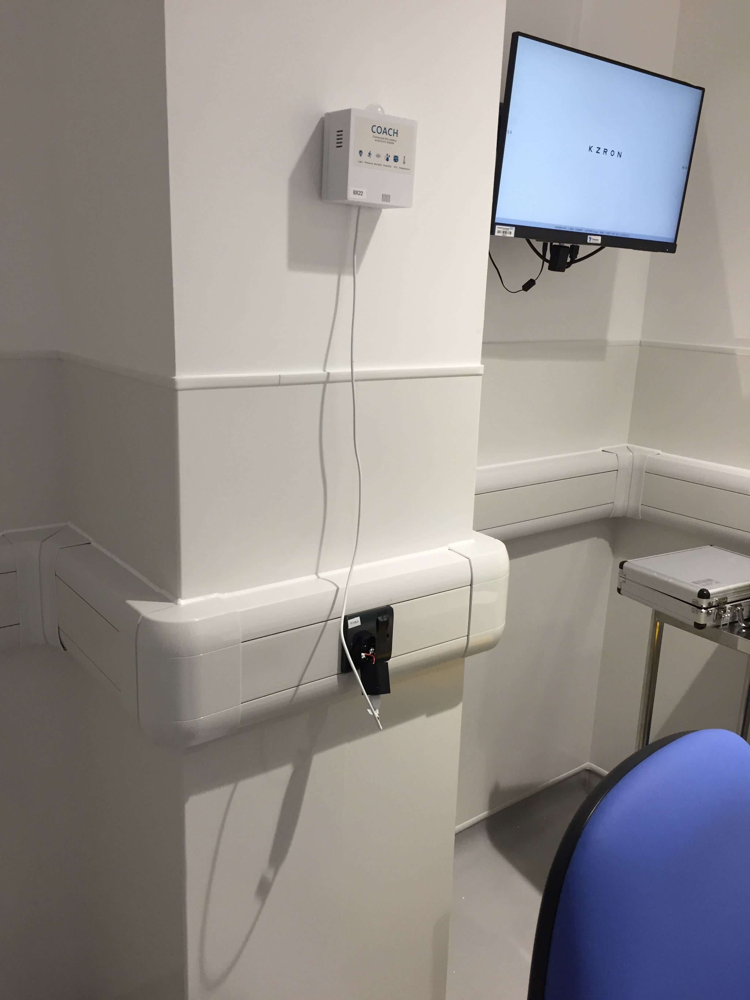
3. Got info from staff that cigarette smoke is low or non existing today (felt it myself). Also they said smoke tends to be high on Monday and Tuesday, less on the other days of the week. And also less if it’s raining outside (because smokers can't use the smoking area in this case).
4. Less patients than usual today, staff told me that's the site is under-booked due to management process...
5. Explained by staff: patients usually start coming into the waiting area at 9 am, they start getting into cubicles at 10 am. Usually, all patients are out by 5 pm, only cleaning staff remains after that until 8 pm.
6. The shopping centre opens at 9 am and closes at 9 pm.

# BX2 visit 7/3/2022 @ ~ 4 pm

1. Restarted bx24
2. Plugged in bx23 (was unplugged partially).
3. Changed broken adapter of bx1

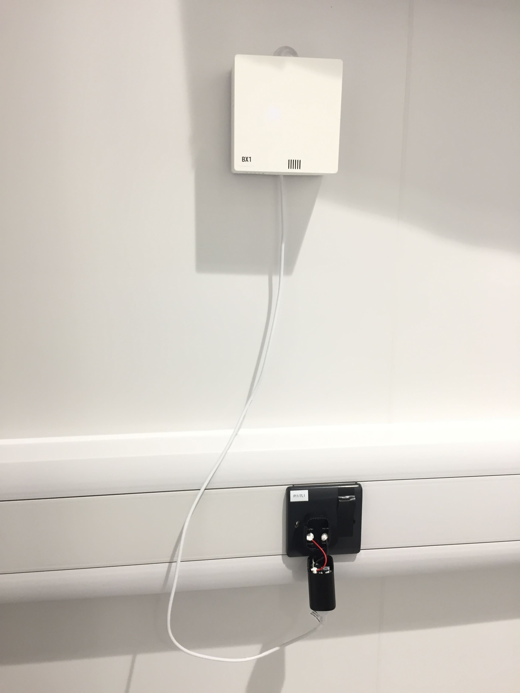

4. New sticker has been put on all wall-mounted boxes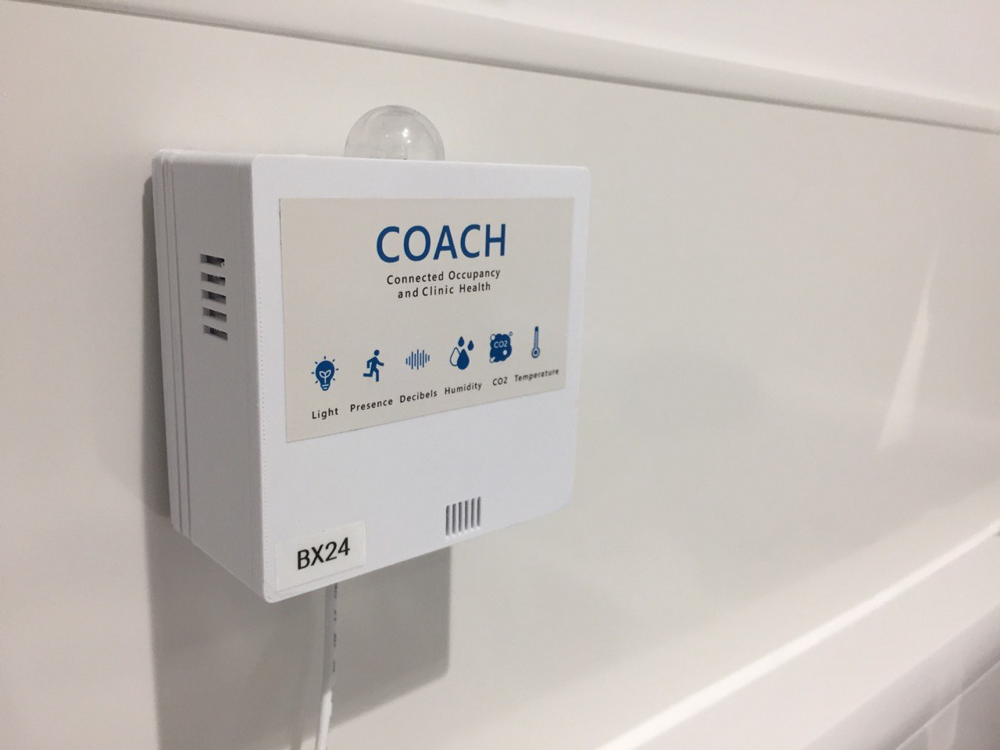
5. As a summary: Two boxes were offline; one semi-unplugged and one needed reboot. The rest stayed online from last week, which is surprisingly good – probably because there were no network breakdowns.
6. Cigarette smoke has gotten worse, it’s all over the clinic today. The staff showed me the supply vent which is directly above the smoking area.

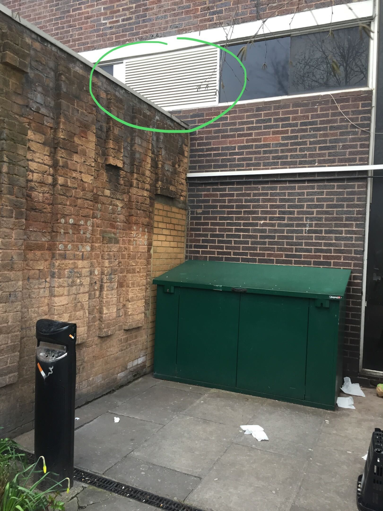

They put a completely hidden non-smoking sign on one side and left the smoking bin on the other side, so smokers are still using it as usual.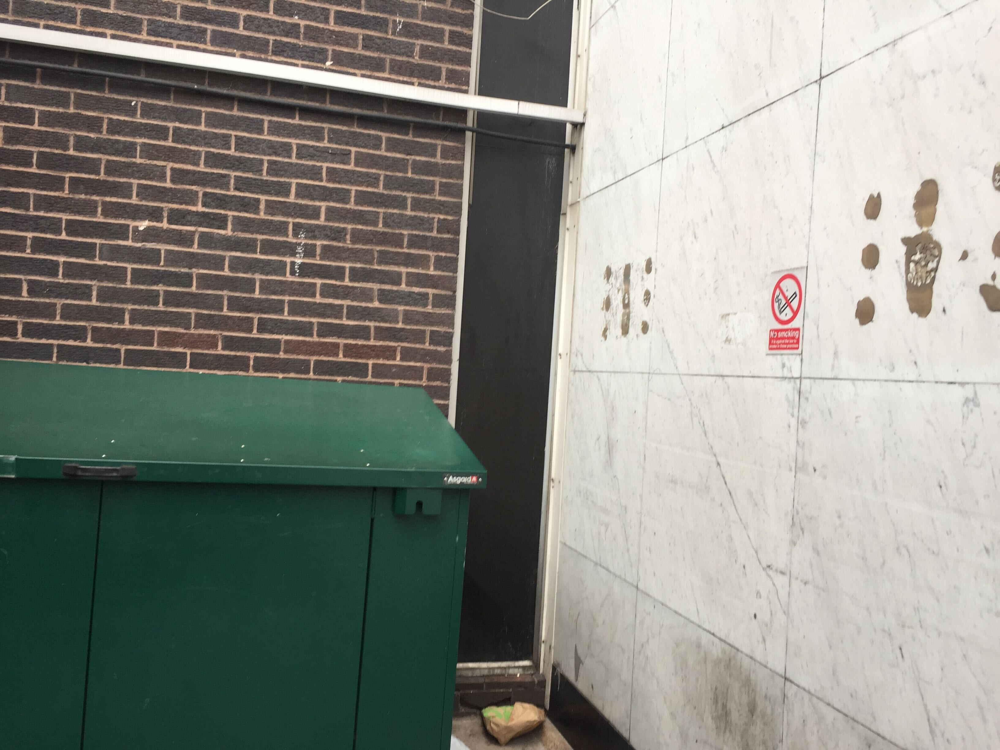

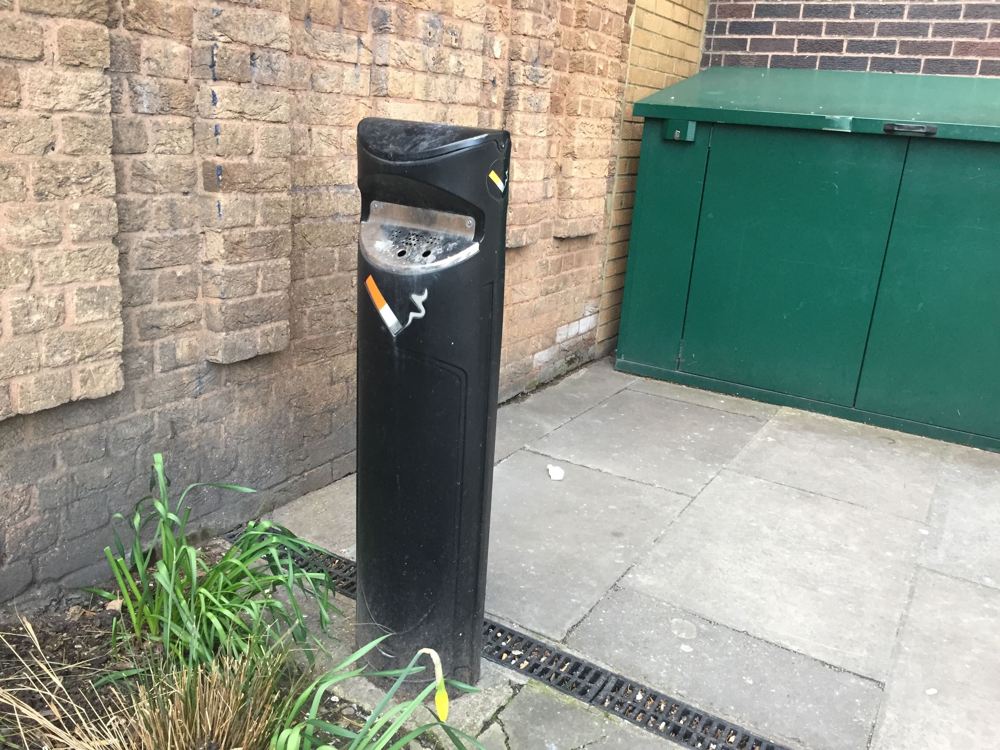

It’s literally very annoying to stay here for more than one hour because of this.

7. More patients in the waiting areas today compared to last week. Saw one of them wondering around the clinic trying to ask when their turn is going to be after waiting 1.5h.
8. Presence validation is done, we have bx26 with a faulty mmWave sensor that doesn’t match the usage state, it worked well after a restart.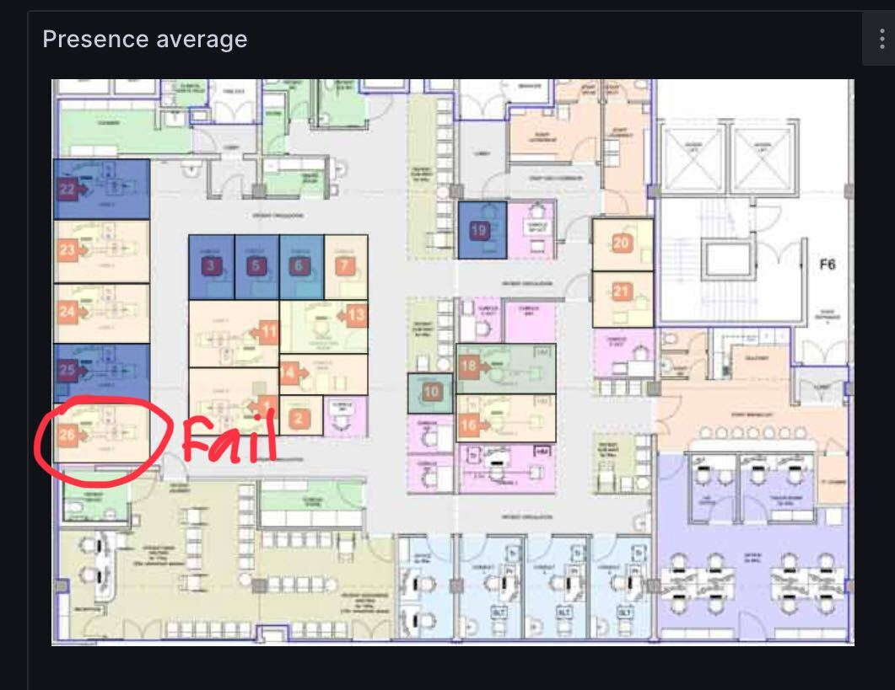

# BX2 visit 29/2/2024 @ ~4 pm

1. Changed broken plug of bx22

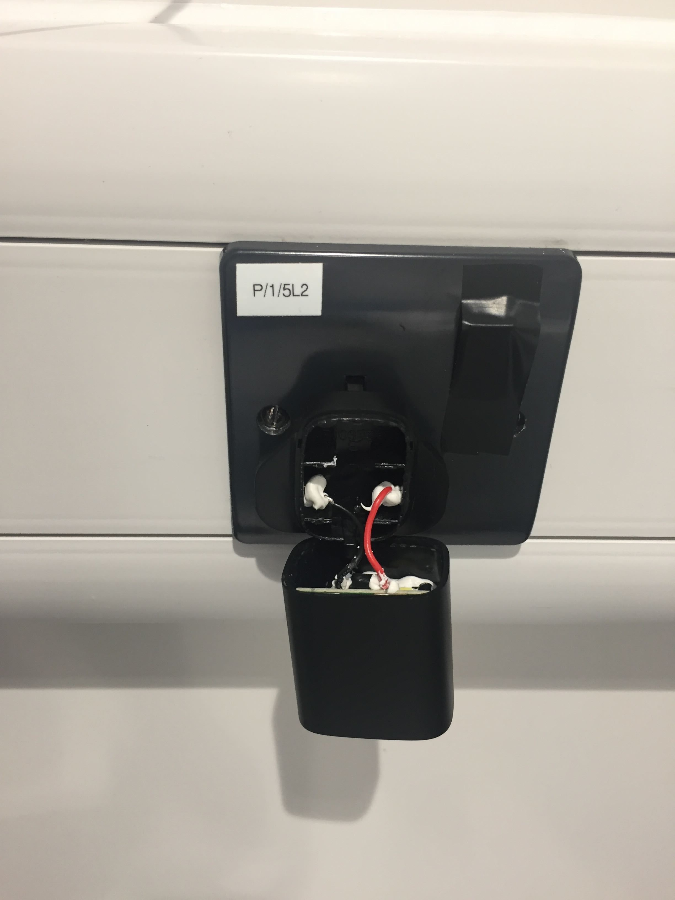

2. Network is fine, I was surprised all of them were not connected. Just restarted them one by one.

3. For data analysis later; I smelled cigarette smoke every time I was around this area. Staff also complained about this and thought someone was smoking, turned out the supply shaft of the HVAC system in the highlighted area on the map is positioned directly above the smoking area of Brent Cross shopping centre!
   Vasili knew about this and they are trying now to change the location of the smoking area or extend the shaft itself.
   This could affect our CO2 readings I think.

   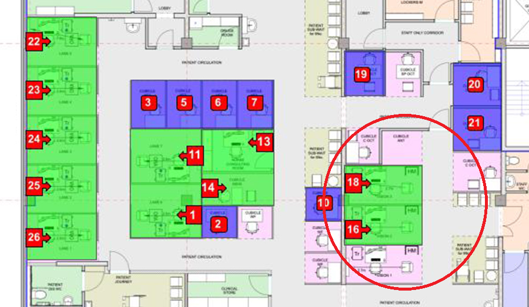

   

4. Also did some monitoring for these cubicles, mmWave and sound sensors seem to match the usage state
   
   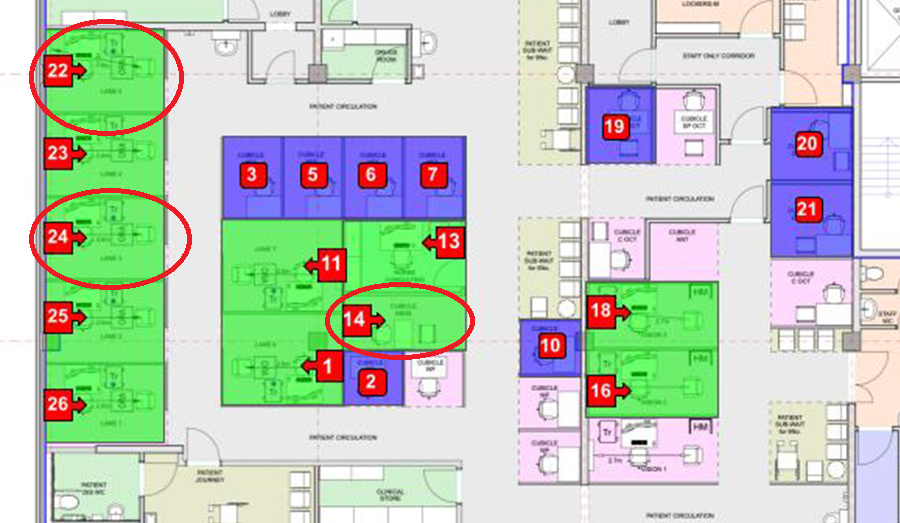