# Overview Stats 

(Overview graphs at bottom of page)

## P1 - Mean Journey Time = 1 hour 17 mins (77 mins)
```
Earliest Date:  2021-10-11 10:36:54
Latest Date:    2021-11-18 16:30:35

start record count:  76556
clean record count:  74118

count                         1028
mean     0 days 01:17:42.882295719
std      0 days 00:26:01.381706145
min                0 days 00:15:24
25%         0 days 01:00:28.500000
50%         0 days 01:14:11.500000
75%         0 days 01:31:20.500000
max                0 days 05:45:35
```

## P2 - Mean Journey Time = 1 hour 9 mins (69 mins)
```
Earliest Date:  2021-11-30 10:10:16
Latest Date:    2021-12-06 16:36:10

start record count:  21156
clean record count:  21128

count                          187
mean     0 days 01:09:26.427807486
std      0 days 00:19:02.283573476
min                0 days 00:16:41
25%         0 days 00:55:26.500000
50%                0 days 01:08:36
75%                0 days 01:22:29
max                0 days 02:09:40
```

## P3 - Mean Journey Time = 1 hour 8 mins (68 mins)
```
Earliest Date:  2022-01-31 17:14:10
Latest Date:    2022-05-20 15:49:28

start record count:  109373
clean record count:  108878

count                         1086
mean     0 days 01:08:03.673112338
std      0 days 00:26:48.342092527
min                0 days 00:19:03
25%         0 days 00:49:53.250000
50%         0 days 01:03:58.500000
75%         0 days 01:20:34.750000
max                0 days 04:37:15
```

## P4 - Mean Journey Time = 1 hour 31 mins (91 mins)
```
Earliest Date:  2022-09-07 10:35:55
Latest Date:    2023-04-06 14:04:55

start record count:  212381
clean record count:  211640

count                         1033
mean     0 days 01:31:40.815101645
std      0 days 00:41:49.317397624
min                0 days 00:16:03
25%                0 days 01:00:00
50%                0 days 01:23:57
75%                0 days 01:54:34
max                0 days 04:45:19
```

# Journey Time Comparisons

Note: box plots only show data within 3 standard deviations - hence whiskers max and min at <3 SD's

Visit length for each 5 day of week:
P1 |  P2  | P3 | P4
:-------------------------:|:-------------------------:|:-------------------------:|:-------------------------:
  |    |     |  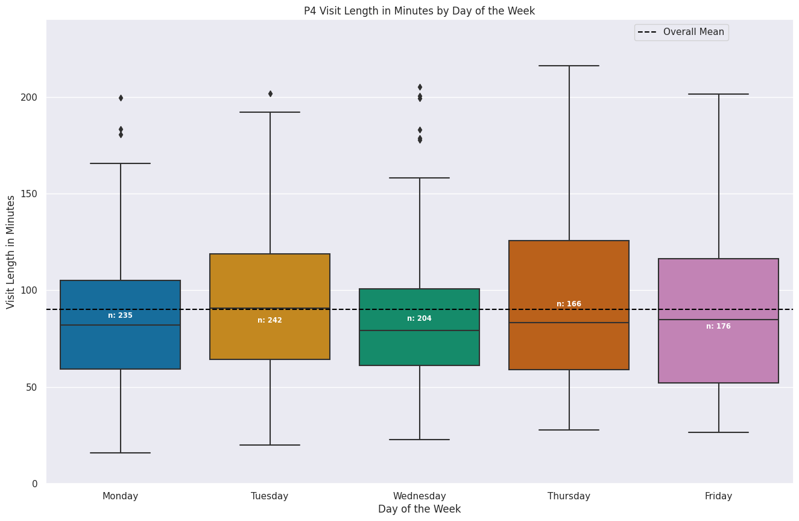

Visit length for each 7 day of week:
P1 |  P2  | P3 | P4
:-------------------------:|:-------------------------:|:-------------------------:|:-------------------------:
  |    |     |  

Visit length by week of trial:
P1 |  P2  | P3 | P4
:-------------------------:|:-------------------------:|:-------------------------:|:-------------------------:
  |    |     |  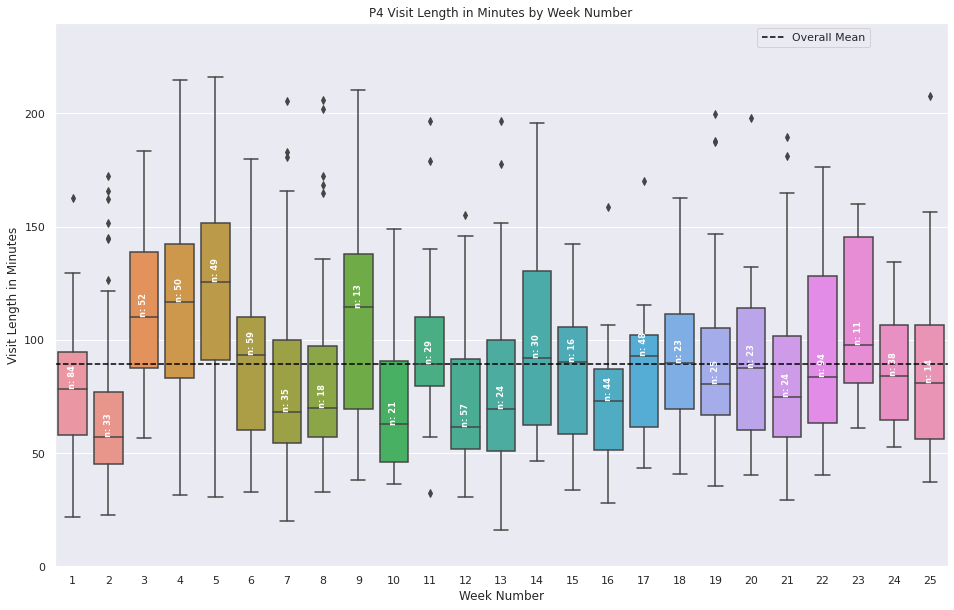

Visit length by day of trial:
P1 |  P2  | P3 | P4
:-------------------------:|:-------------------------:|:-------------------------:|:-------------------------:
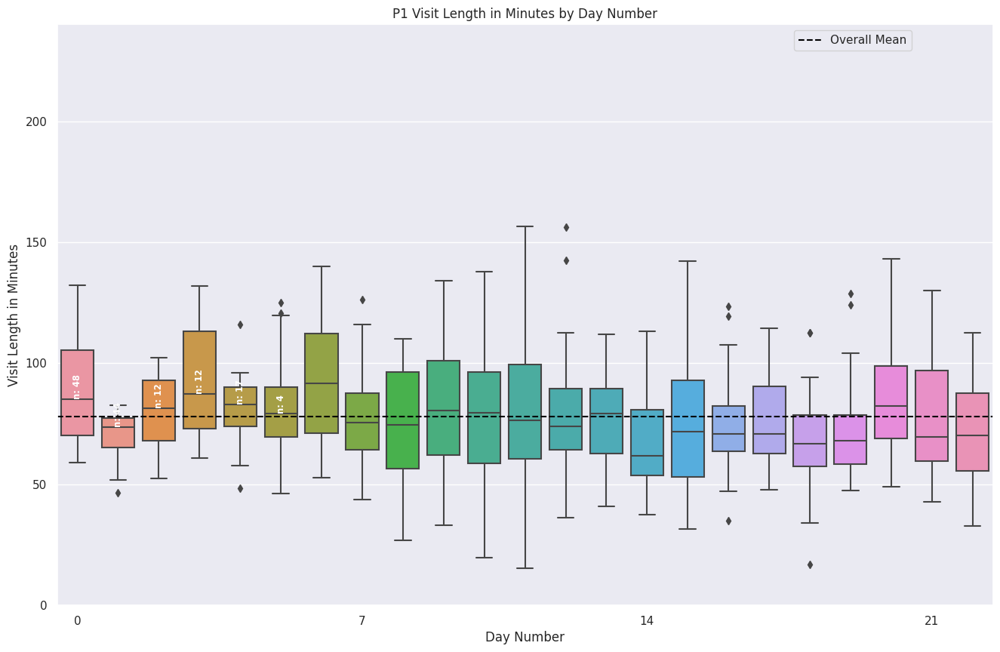  |  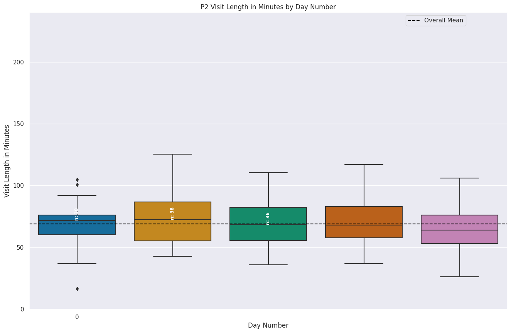  |  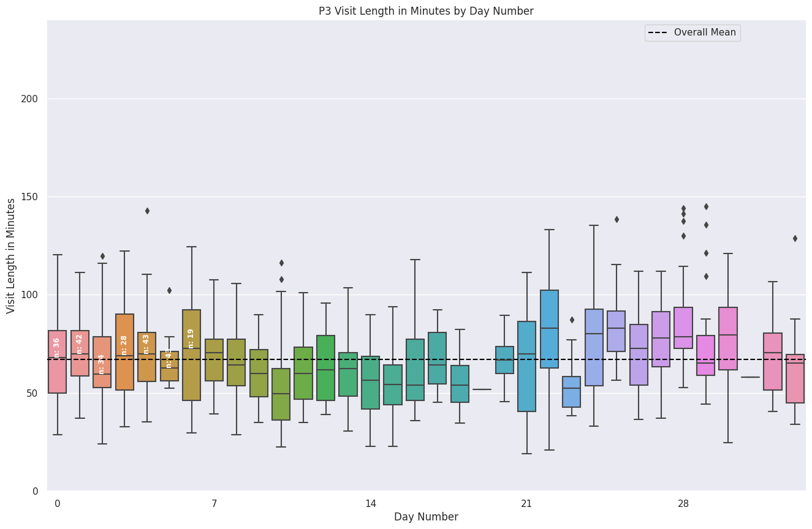   |  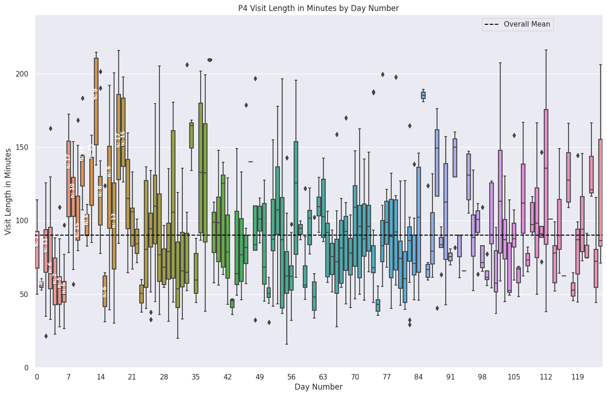

Visit length by morning or afternoon:
P1 |  P2  | P3 | P4
:-------------------------:|:-------------------------:|:-------------------------:|:-------------------------:
  |    |     |  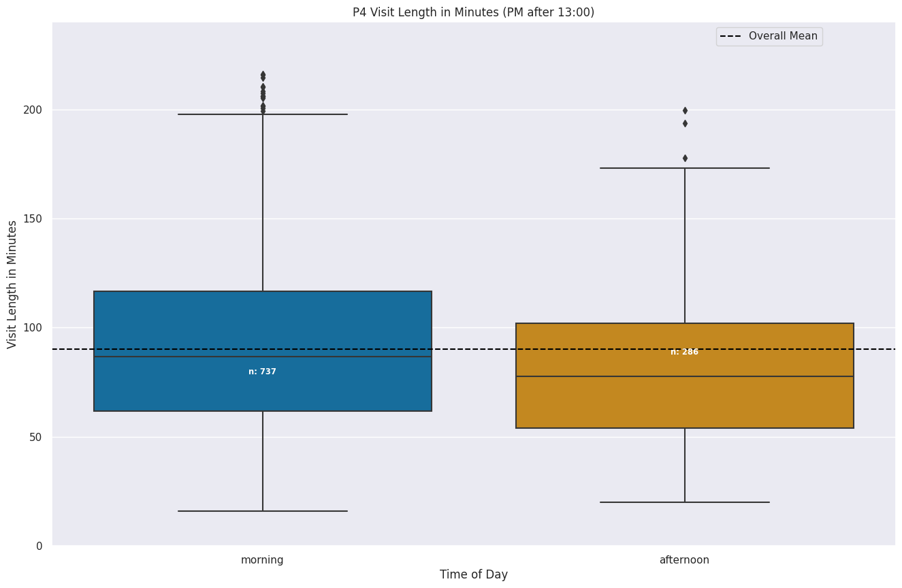

Visit length by hour of day:
P1 |  P2  | P3 | P4
:-------------------------:|:-------------------------:|:-------------------------:|:-------------------------:
  |    |     |  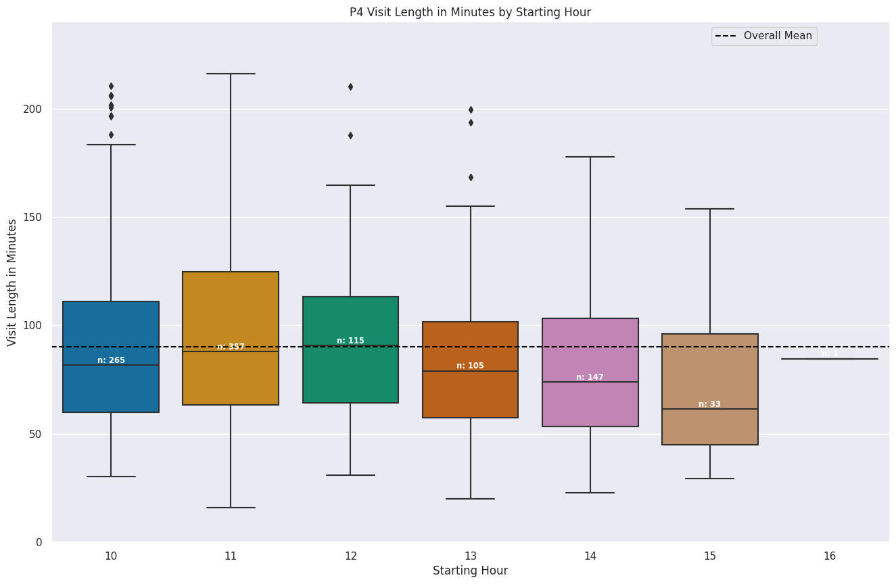


Visit length by condition:
P1 |  P2  | P3 | P4
:-------------------------:|:-------------------------:|:-------------------------:|:-------------------------:
  |    |    |  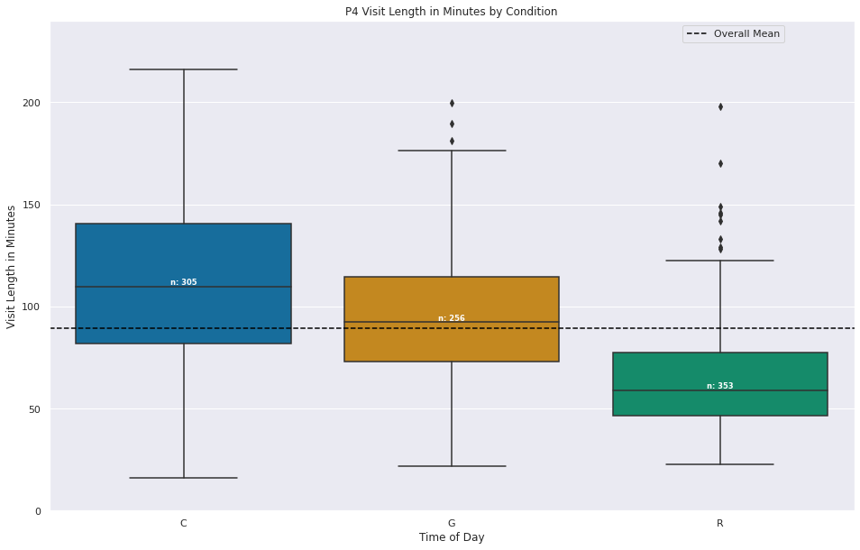 


Visit length by phase:
P1 |  P2  | P3 | P4
:-------------------------:|:-------------------------:|:-------------------------:|:-------------------------:
  |    |    |  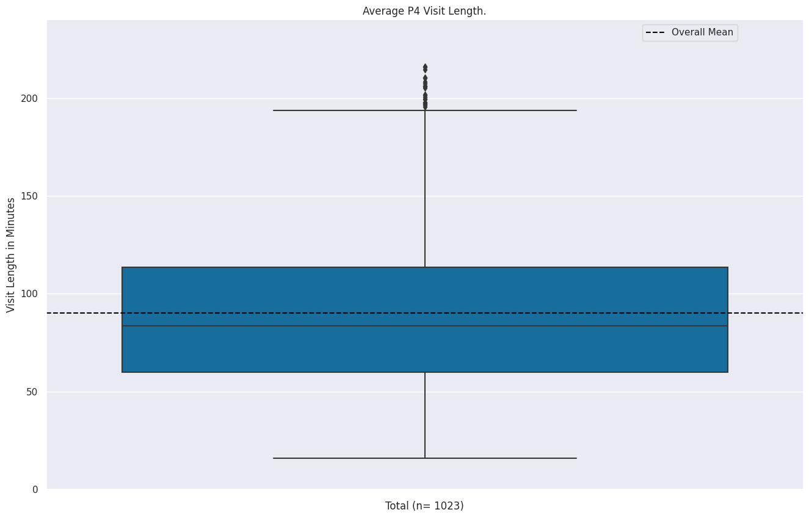


Visit length by phase as distribution histogram:
P1 |  P2  | P3 | P4
:-------------------------:|:-------------------------:|:-------------------------:|:-------------------------:
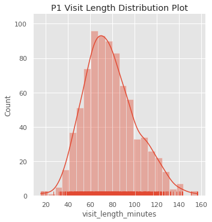  |  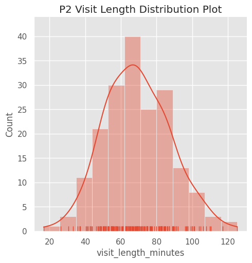  |  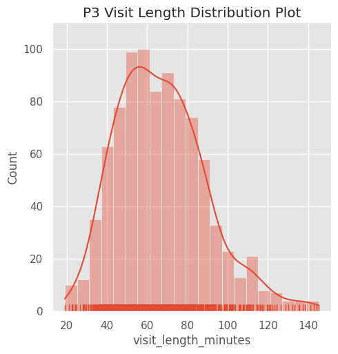  |  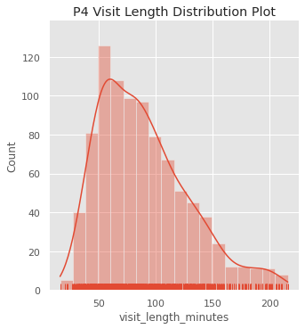


Visit length by phase as KDE:
P1 |  P2  | P3 | P4
:-------------------------:|:-------------------------:|:-------------------------:|:-------------------------:
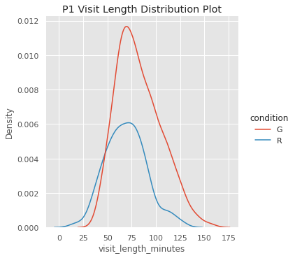  |  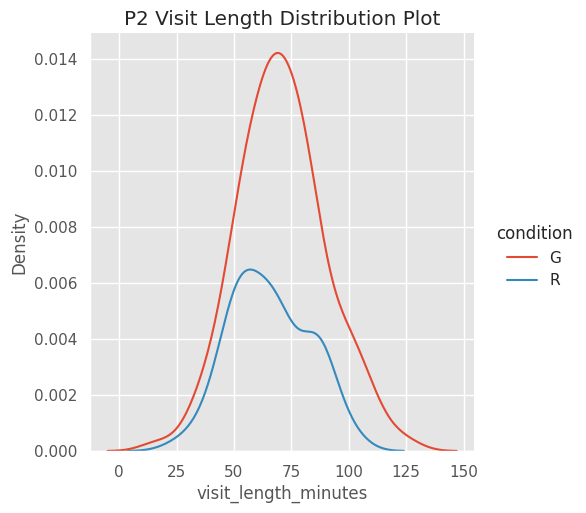  |  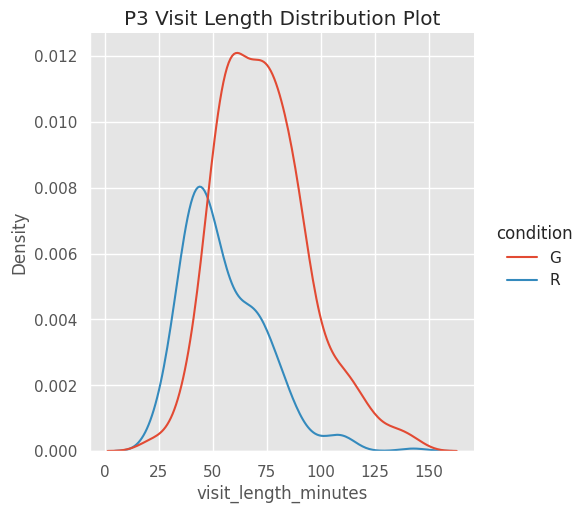  |  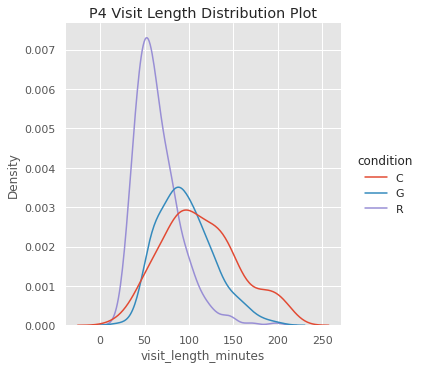

Visit length by phase Regression Analysis:
P1 |  P2  | P3 | P4
:-------------------------:|:-------------------------:|:-------------------------:|:-------------------------:
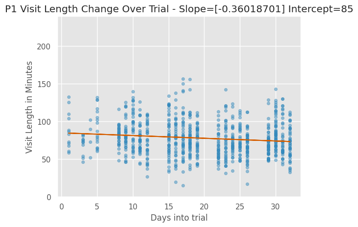  |  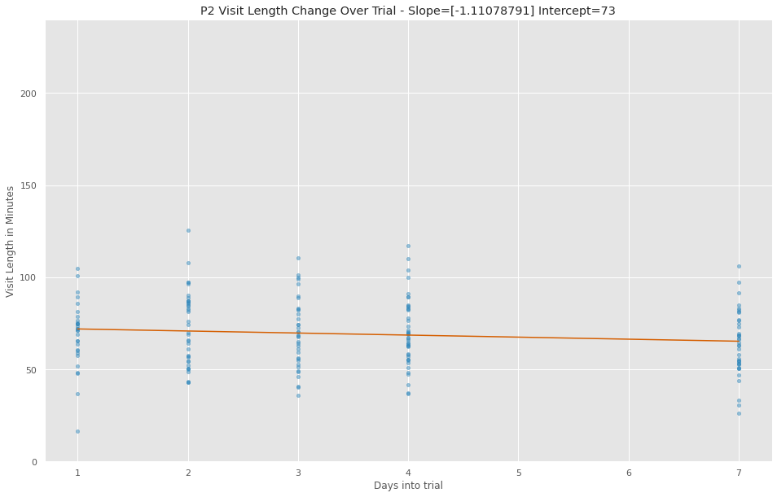  |  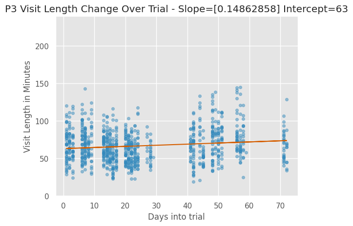  |  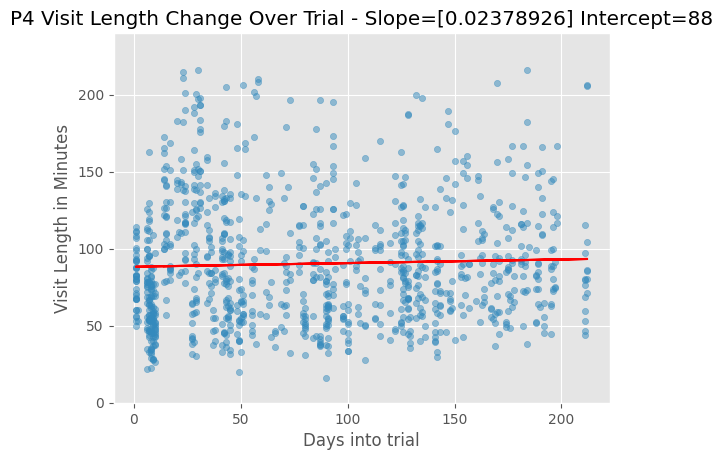
