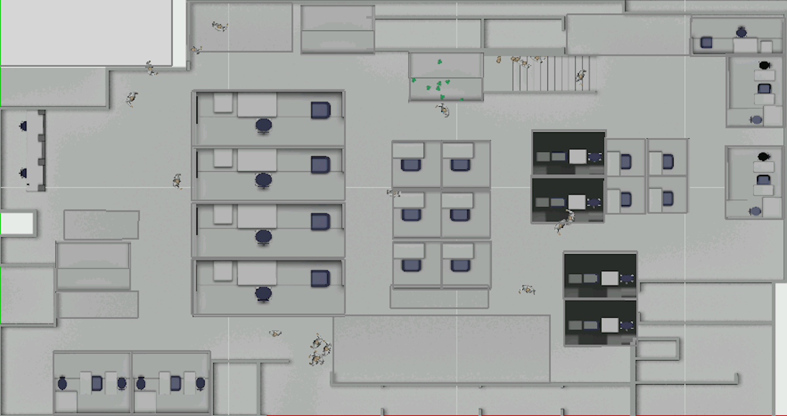

# Phases Layouts

[Processing.org](www.processing.org) scripts in this folder include:
- [load_data](/data_vis_pde/load_data/) - used to explore all patient journeys for a phase
- [plots](/data_vis_pde/plots/) - used to draw a single patient journey

Information on each of the layouts is below.

## Phase 1

Bottom left corner 0,0

Top right corner 34.441, 18.209

These are the coordinates based on this image.

## Phase 2

Bottom left corner 0,0

Top right corner 34.441, 18.209

These are the coordinates based on this image.

## Phase 3

Bottom left corner 0,0

Top right corner 34.441, 18.209

These are the coordinates based on this image.

## Phase 4

Bottom left corner 0,0

Top right corner 34.441, 18.209

These are the coordinates based on this image.

